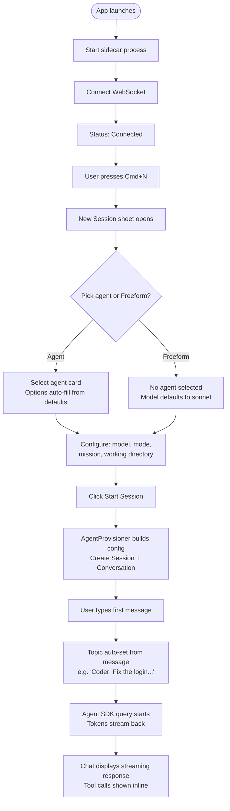
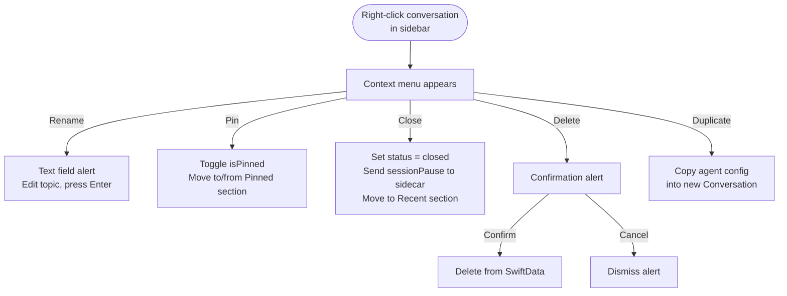
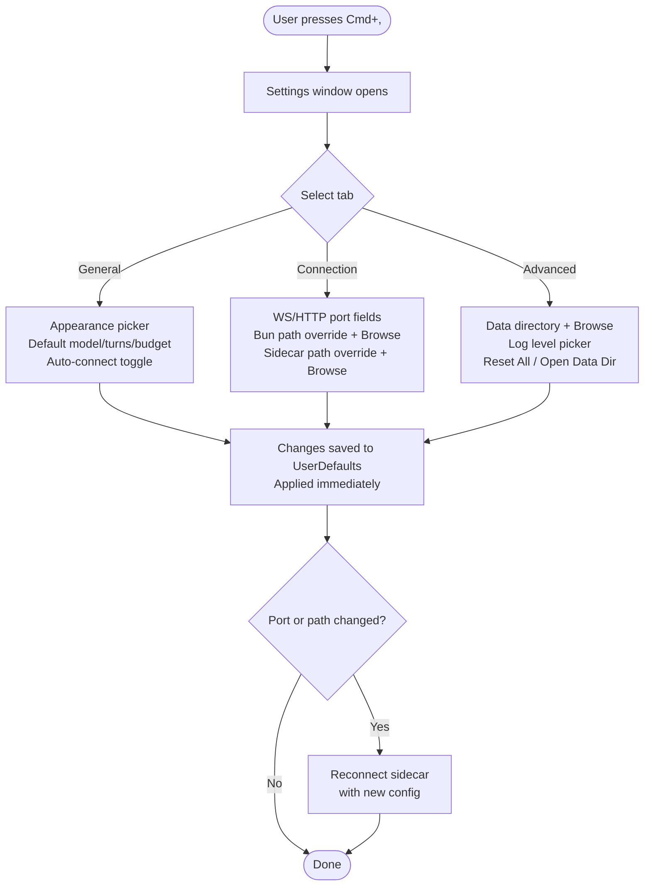
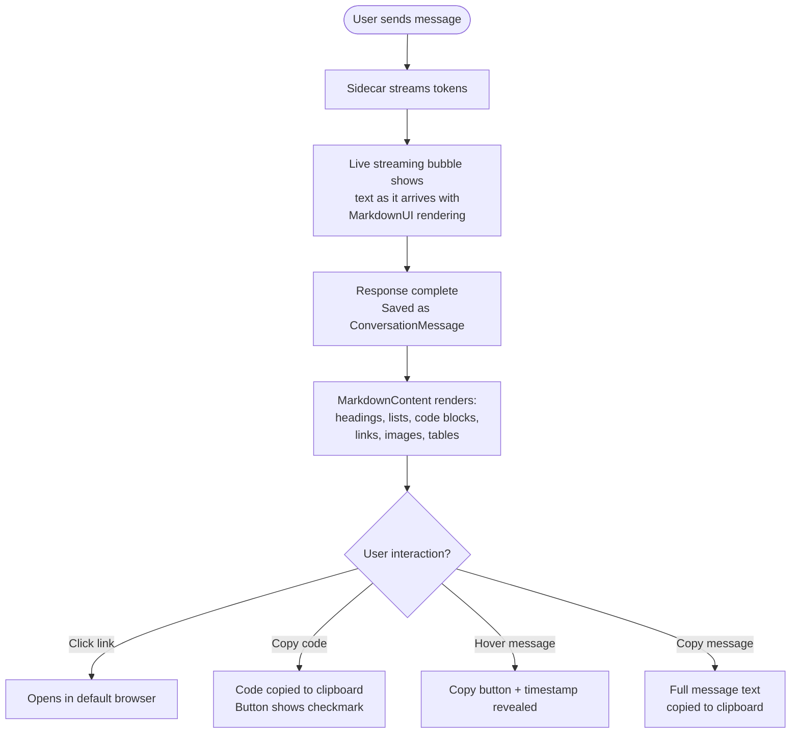

# ClaudPeer — Functional Specification

Living specification tracking implemented features, user flows, and requirements.

**Version:** 0.1.0
**Status:** Early development (Phase 1-2 of roadmap)

---

## 1. Product Summary

ClaudPeer is a native macOS developer tool for managing multiple Claude AI agent sessions. Users define reusable agent templates with skills, MCP servers, and permissions, then launch interactive sessions that stream AI responses in real-time through a chat interface.

### Target Users
- Developers using Claude for coding tasks who want persistent, configurable agent sessions
- Teams wanting to share agent definitions across machines (planned)

### Core Value Proposition
- **Multi-agent orchestration** — run multiple Claude sessions simultaneously with different configurations
- **Composable agents** — build agents from reusable skills, MCP servers, and permission presets
- **Persistent conversations** — conversations survive app restarts, resumable via Claude session IDs
- **Native macOS experience** — SwiftUI three-panel layout optimized for developer workflows

---

## 2. Functional Requirements

### FR-1: Sidecar Lifecycle Management

**Status:** Implemented

The app manages a TypeScript sidecar process that hosts Claude Agent SDK sessions.

| Requirement | Status |
|---|---|
| FR-1.1: Auto-launch Bun sidecar on app start | Done |
| FR-1.2: WebSocket connection on localhost:9849 | Done |
| FR-1.3: Auto-reconnect on WebSocket disconnect | Done |
| FR-1.4: Relaunch sidecar if process terminates | Done |
| FR-1.5: Try connecting to existing sidecar before launching new one | Done |
| FR-1.6: Log sidecar output to ~/.claudpeer/logs/sidecar.log | Done |
| FR-1.7: Find Bun at standard paths (Homebrew, ~/.bun/bin) | Done |
| FR-1.8: Find sidecar at bundle, cwd, ~/ClaudPeer, or UserDefaults path | Done |
| FR-1.9: Graceful shutdown on app exit | Done |
| FR-1.10: Connection status reflected in UI (AppState.sidecarStatus) | Done |

### FR-2: Agent Management

**Status:** Implemented (basic CRUD)

Users create and manage reusable agent templates.

| Requirement | Status |
|---|---|
| FR-2.1: Create agent with name, description, system prompt | Done |
| FR-2.2: Configure model (sonnet, opus, haiku) | Done |
| FR-2.3: Set max turns and budget limits | Done |
| FR-2.4: Assign skills from pool (by ID reference) | Done |
| FR-2.5: Assign MCP servers from pool (by ID reference) | Done |
| FR-2.6: Assign permission set (by ID reference) | Done |
| FR-2.7: Set instance policy (spawn/singleton/pool) | Done (model) |
| FR-2.8: Set default working directory | Done |
| FR-2.9: Link GitHub repo and default branch | Done |
| FR-2.10: Set icon and color | Done |
| FR-2.11: Agent library grid view | Done |
| FR-2.12: Agent editor view | Done |
| FR-2.13: Persist agents in SwiftData | Done |

### FR-3: Session Lifecycle

**Status:** Implemented

Sessions are running instances of agents.

| Requirement | Status |
|---|---|
| FR-3.1: Create session from agent + optional mission | Done |
| FR-3.2: Resolve working directory (explicit/GitHub/default/ephemeral) | Done |
| FR-3.3: Provision AgentConfig from SwiftData models | Done |
| FR-3.4: Send session.create command to sidecar | Done |
| FR-3.5: Send messages to active sessions | Done |
| FR-3.6: Receive streaming tokens from sidecar | Done |
| FR-3.7: Receive tool call/result events | Done |
| FR-3.8: Receive session result with cost | Done |
| FR-3.9: Handle session errors | Done |
| FR-3.10: Resume sessions via Claude session ID | Done |
| FR-3.11: Fork sessions (branch conversation) | Done |
| FR-3.12: Pause/abort running sessions | Done |
| FR-3.13: Track session status (active/paused/completed/failed) | Done |
| FR-3.14: Instance policy enforcement (singleton/pool routing) | Not started |

### FR-4: Conversation Model

**Status:** Implemented (user↔agent only)

Unified conversation model supporting user-to-agent and agent-to-agent communication.

| Requirement | Status |
|---|---|
| FR-4.1: Create conversation with participants | Done |
| FR-4.2: Persist messages in SwiftData | Done |
| FR-4.3: Message types: text, toolCall, toolResult, delegation, blackboard | Done (model) |
| FR-4.4: Participant types: user, agentSession | Done |
| FR-4.5: Participant roles: active, observer | Done (model) |
| FR-4.6: Parent-child conversation tree (spawned conversations) | Done (model) |
| FR-4.7: Conversation status (active/closed) | Done |
| FR-4.8: Agent-to-agent conversations | Not started |
| FR-4.9: Group conversations (user + multiple agents) | Not started |

### FR-5: Chat UI

**Status:** Implemented

| Requirement | Status |
|---|---|
| FR-5.1: Display conversation messages in chronological order | Done |
| FR-5.2: Text input with send button | Done |
| FR-5.3: Streaming text display during agent response | Done |
| FR-5.4: Tool call blocks (collapsible) | Done |
| FR-5.5: Message bubbles with participant distinction | Done |
| FR-5.6: Conversation tree node component | Done |
| FR-5.7: Status badges (session/conversation) | Done |
| FR-5.8: Slash commands in input | Not started |
| FR-5.9: File drag-and-drop | Not started |
| FR-5.10: @-mention agents in group chats | Not started |
| FR-5.11: Fork from any message point | Not started |
| FR-5.12: Auto-name conversations from first user message | Done |
| FR-5.13: Rename conversations via context menu, chat header, or inspector | Done |
| FR-5.14: Pin/unpin conversations in sidebar | Done |
| FR-5.15: Close and delete conversations via context menu | Done |
| FR-5.16: New Session sheet with agent/model/mode/mission/working-dir picker | Done |
| FR-5.17: Chat header actions (close, resume, clear, rename, model pill, live cost) | Done |
| FR-5.18: Rich markdown rendering for agent messages (MarkdownUI) | Done |
| FR-5.19: Code blocks with language label and copy-to-clipboard button | Done |
| FR-5.20: Live streaming text bubble (shows streamed text as it arrives, not just dots) | Done |
| FR-5.21: Hover-to-reveal copy button on any message | Done |
| FR-5.22: Hover-to-reveal timestamp (reduces visual noise) | Done |
| FR-5.23: Clickable links in agent responses (opens in default browser) | Done |
| FR-5.24: Inline images rendered via MarkdownUI | Done |
| FR-5.25: Custom MarkdownUI theme (.claudPeer) with styled headings, blockquotes, tables, code | Done |

### FR-6: Main Window Layout

**Status:** Implemented

| Requirement | Status |
|---|---|
| FR-6.1: Three-panel NavigationSplitView | Done |
| FR-6.2: Sidebar with conversation list | Done |
| FR-6.3: Sidebar with agent list section | Done |
| FR-6.4: Detail area showing ChatView | Done |
| FR-6.5: Inspector panel with session metadata | Done |
| FR-6.6: Toolbar: new session, quick chat, agent library, peer network | Done |
| FR-6.7: Default window size 1200x800 | Done |
| FR-6.8: Sidebar rows show relative timestamps, message preview, and agent icon | Done |
| FR-6.9: Sidebar has Pinned section above Active | Done |
| FR-6.10: Sidebar conversation context menu (rename, pin, close, delete, duplicate) | Done |
| FR-6.11: Sidebar empty state when no conversations exist | Done |
| FR-6.12: Inspector panel with session action buttons (resume/pause/stop) | Done |
| FR-6.13: Agent card Start button launches session and dismisses library | Done |

### FR-7: Blackboard

**Status:** Implemented (HTTP API + disk persistence)

| Requirement | Status |
|---|---|
| FR-7.1: In-memory key-value store | Done |
| FR-7.2: Persist to JSON on disk (~/.claudpeer/blackboard/) | Done |
| FR-7.3: HTTP POST /blackboard/write | Done |
| FR-7.4: HTTP GET /blackboard/read | Done |
| FR-7.5: HTTP GET /blackboard/query (glob pattern) | Done |
| FR-7.6: HTTP GET /blackboard/keys | Done |
| FR-7.7: HTTP GET /blackboard/health | Done |
| FR-7.8: CORS headers for localhost | Done |
| FR-7.9: Blackboard as custom SDK tools for agents | Not started |
| FR-7.10: WebSocket subscription for live updates | Not started |
| FR-7.11: Blackboard events forwarded to Swift UI | Not started |

### FR-8: Agent Provisioning

**Status:** Implemented

| Requirement | Status |
|---|---|
| FR-8.1: Resolve skills by ID from SwiftData | Done |
| FR-8.2: Resolve MCP servers by ID from SwiftData | Done |
| FR-8.3: Resolve permission set by ID from SwiftData | Done |
| FR-8.4: Build system prompt with skills appended | Done |
| FR-8.5: Build allowed tools from permissions + PeerBus tools | Done |
| FR-8.6: Map MCP servers to SDK config (stdio/SSE) | Done |
| FR-8.7: Append GitHub repo context to system prompt | Done |
| FR-8.8: Append mission to system prompt | Done |
| FR-8.9: Working dir: explicit path override | Done |
| FR-8.10: Working dir: GitHub clone path | Done |
| FR-8.11: Working dir: agent default | Done |
| FR-8.12: Working dir: ephemeral sandbox fallback | Done |

### FR-9: Application Preferences (Settings)

**Status:** Implemented

Configurable application preferences accessible via Cmd+, (standard macOS Settings scene).

| Requirement | Status |
|---|---|
| FR-9.1: Three-tab settings window (General, Connection, Advanced) | Done |
| FR-9.2: Appearance picker (System/Light/Dark) applied app-wide via preferredColorScheme | Done |
| FR-9.3: Default model picker (sonnet/opus/haiku) | Done |
| FR-9.4: Default max turns stepper (1-100) | Done |
| FR-9.5: Default max budget field | Done |
| FR-9.6: Auto-connect sidecar toggle | Done |
| FR-9.7: WebSocket port override (default 9849) | Done |
| FR-9.8: HTTP API port override (default 9850) | Done |
| FR-9.9: Bun path override with file picker | Done |
| FR-9.10: Sidecar project path override with folder picker | Done |
| FR-9.11: Data directory path with folder picker | Done |
| FR-9.12: Log level picker (debug/info/warning/error) | Done |
| FR-9.13: Reset All Settings button with confirmation | Done |
| FR-9.14: Open Data Directory in Finder button | Done |
| FR-9.15: Settings persisted via @AppStorage (UserDefaults) | Done |
| FR-9.16: SidecarManager accepts configured ports and path overrides from settings | Done |
| FR-9.17: Centralized AppSettings enum with all keys and defaults | Done |

---

## 3. User Stories

### US-1: Create and Configure an Agent
**As a** developer, **I want to** create a reusable agent template with specific skills and permissions, **so that** I can quickly launch configured Claude sessions for different tasks.

**Acceptance criteria:**
- [x] Can create agent with name, description, system prompt
- [x] Can select model, set turn/budget limits
- [x] Can assign skills, MCPs, permissions from pools
- [x] Can set working directory and GitHub repo
- [x] Agent persists across app restarts

### US-2: Start a Conversation
**As a** developer, **I want to** start a chat with an agent, **so that** I can get AI assistance with my coding tasks.

**Acceptance criteria:**
- [x] Can select an agent and start a new conversation
- [x] Can provide a mission/goal for the session
- [x] Messages stream in real-time
- [x] Tool calls are visible in the chat
- [x] Session cost is tracked

### US-3: Resume a Previous Session
**As a** developer, **I want to** continue a paused conversation, **so that** I don't lose context from previous interactions.

**Acceptance criteria:**
- [x] Conversations persist in sidebar
- [x] Can resume session with full Claude context (via session ID)
- [x] Can view historical messages without resuming

### US-4: Manage Multiple Sessions
**As a** developer, **I want to** run multiple agent sessions simultaneously, **so that** I can work on different tasks in parallel.

**Acceptance criteria:**
- [x] Sidebar shows all conversations
- [x] Can switch between conversations
- [x] Multiple sessions can stream concurrently
- [x] Inspector shows metadata for selected conversation

### US-5: Use Blackboard for External Integration
**As a** developer, **I want to** read/write structured data via HTTP, **so that** scripts and tools can exchange information with agents.

**Acceptance criteria:**
- [x] HTTP API on localhost:9850
- [x] Write, read, query, list keys operations
- [x] Data persists to disk
- [x] Health check endpoint available

### US-6: Manage Conversations
**As a** developer, **I want to** organize my conversations by renaming, pinning, closing, and deleting them, **so that** I can keep my workspace clean and quickly find important sessions.

**Acceptance criteria:**
- [x] Can rename conversations via context menu, chat header, or inspector
- [x] Can pin/unpin conversations to keep them at the top
- [x] Can close active sessions from sidebar, header, or inspector
- [x] Can delete conversations with confirmation
- [x] Can duplicate conversations with their agent config
- [x] Conversations auto-name from first message text

### US-7: Start a Session with Options
**As a** developer, **I want to** choose an agent, model, mode, mission, and working directory when starting a session, **so that** I can configure each session for its specific task.

**Acceptance criteria:**
- [x] New Session sheet (Cmd+N) with agent grid picker
- [x] Model override dropdown
- [x] Session mode selector (interactive/autonomous/worker)
- [x] Optional mission text field
- [x] Working directory picker with folder browser
- [x] Quick Chat shortcut (Cmd+Shift+N) for freeform sessions

### US-8: Configure Application Preferences
**As a** developer, **I want to** customize the app appearance, default model, and sidecar connection settings, **so that** I can tailor ClaudPeer to my environment and preferences.

**Acceptance criteria:**
- [x] Can switch between System, Light, and Dark appearance
- [x] Appearance change applies immediately to all windows
- [x] Can set default model, max turns, and budget for new sessions
- [x] Can override WebSocket/HTTP ports for sidecar
- [x] Can override Bun and sidecar paths with file/folder pickers
- [x] Can toggle auto-connect on launch
- [x] Can reset all settings to defaults
- [x] Settings persist across app restarts

### US-9: Read Rich Markdown Responses
**As a** developer, **I want to** see Claude's responses rendered with proper markdown formatting, **so that** code blocks, links, headers, and lists are easy to read and interact with.

**Acceptance criteria:**
- [x] Agent messages render headings, lists, bold, italic, blockquotes, tables
- [x] Code blocks display with language label and monospaced font
- [x] Code blocks have a Copy button that copies contents to clipboard
- [x] Links are clickable and open in the default browser
- [x] User messages remain plain text (not rendered as markdown)
- [x] Streaming text appears live as it arrives (not just animated dots)
- [x] Can copy any message via hover copy button

---

## 4. User Flows

### Flow 1: App Launch → New Session

### Flow 2: Resume Conversation

### Flow 3: Manage Conversations

### Flow 4: Configure Settings

### Flow 5: Read a Markdown Response

---

## 5. Non-Functional Requirements

| Requirement | Target | Status |
|---|---|---|
| macOS version | 14.0+ (Sonoma) | Met |
| Swift version | 6.0 (strict concurrency) | Met |
| Startup time | Sidecar ready within 1s | Met (~500ms) |
| Reconnect | Auto-reconnect within 5s | Met |
| Persistence | SwiftData (local, CloudKit-ready) | Met |
| Memory | Graceful with 10+ concurrent sessions | Untested |
| Security | Hardened runtime, localhost-only sidecar | Met |

---

## 6. Change Log

| Date | Change | Affected |
|---|---|---|
| 2026-03-21 | Rich markdown chat: MarkdownUI rendering for agent messages, code blocks with copy button, live streaming text, hover copy/timestamp, clickable links. Settings screen: three-tab preferences (General/Connection/Advanced) with dark mode, port/path overrides, reset. SidecarManager accepts configurable settings. | FR-5.18-5.25, FR-9, US-8, US-9, Flow 4, Flow 5 |
| 2026-03-21 | UX improvements: smart naming, conversation management (rename/pin/close/delete/duplicate), New Session sheet, sidebar polish (timestamps, previews, pinned section, empty state, agent icons, swipe actions), chat header enhancements (rename, close/resume, clear, model pill, cost), inspector actions (pause/resume/stop, editable topic, open in editor), agent card Start button | FR-5, FR-6, US-6, US-7, Flow 1, Flow 3 |
| 2026-03-21 | Initial spec created from implemented codebase | All sections |
