# ClaudeStudio — Functional Specification

Living specification tracking implemented features, user flows, and requirements.

**Version:** 0.14.1
**Status:** Phase 14 — Project-first shell plus intent-first library hub (`Run`, `Build`, `Discover`)

---

## 1. Product Summary

ClaudeStudio is a native macOS developer tool for managing Claude AI agent sessions around **projects**. Users define reusable agent templates with skills, MCP servers, and permissions, then launch direct or team threads that stream AI responses in real time inside a project-owned workspace.

### Target Users
- Developers using Claude for coding tasks who want persistent, configurable agent sessions
- Teams sharing agent definitions across machines on the same LAN (P2P v1)

### Core Value Proposition
- **Multi-agent orchestration** — run multiple Claude sessions simultaneously with different configurations
- **Composable agents** — build agents from reusable skills, MCP servers, and permission presets
- **Intent-first library hub** — launch agents or groups quickly in `Run`, manage reusable definitions in `Build`, and browse/install templates, skills, and integrations in `Discover`
- **Project-first shell** — each project owns its threads, tasks, schedules, and working context
- **Persistent threads** — thread history survives app restarts, resumable via Claude session IDs
- **Recurring missions** — save agent, group, or thread missions and run them on hourly or daily schedules
- **Native macOS experience** — SwiftUI three-panel layout optimized for developer workflows

---

## 2. Functional Requirements

### FR-1: Sidecar Lifecycle Management

**Status:** Implemented

The app manages a TypeScript sidecar process that hosts Claude Agent SDK sessions.

| Requirement | Status |
|---|---|
| FR-1.1: Auto-launch Bun sidecar on app start | Done |
| FR-1.2: WebSocket connection on localhost:9849 | Done |
| FR-1.3: Auto-reconnect on WebSocket disconnect | Done |
| FR-1.4: Relaunch sidecar if process terminates | Done |
| FR-1.5: Try connecting to existing sidecar before launching new one | Done |
| FR-1.6: Log sidecar output to ~/.claudestudio/logs/sidecar.log | Done |
| FR-1.7: Find Bun at standard paths (Homebrew, ~/.bun/bin) | Done |
| FR-1.8: Find sidecar at bundle, cwd, ~/ClaudeStudio, or UserDefaults path | Done |
| FR-1.9: Graceful shutdown on app exit | Done |
| FR-1.10: Connection status reflected in UI (AppState.sidecarStatus) | Done |

### FR-2: Agent Management

**Status:** Implemented (basic CRUD)

Users create and manage reusable agent templates.

| Requirement | Status |
|---|---|
| FR-2.1: Create agent with name, description, system prompt | Done |
| FR-2.2: Configure model (sonnet, opus, haiku) | Done |
| FR-2.3: Set max turns and budget limits | Done |
| FR-2.4: Assign skills from pool (by ID reference) | Done |
| FR-2.5: Assign MCP servers from pool (by ID reference) | Done |
| FR-2.6: Assign permission set (by ID reference) | Done |
| FR-2.7: Set instance policy (spawn/singleton/pool) | Done (model) |
| FR-2.8: Set default working directory | Done |
| FR-2.9: Link GitHub repo and default branch | Done |
| FR-2.10: Set icon and color (9 colors: blue, red, green, purple, orange, teal, pink, indigo, gray) | Done |
| FR-2.11: Agent library grid view | Done |
| FR-2.12: Agent editor view with sheet(item:) presentation for editing | Done |
| FR-2.13: Persist agents in SwiftData | Done |
| FR-2.14: Built-in agents loaded from bundled JSON (7 agents) | Superseded by FR-12 |
| FR-2.15: Per-agent system prompts loaded from dedicated .md files | Done |
| FR-2.16: Agent → Skill → MCP dependency hierarchy (skills declare MCPs, agents select skills) | Done |
| FR-2.17: Duplicate agent with full config copy | Done |
| FR-2.18: catalogId tracking for catalog-originating agents | Done |

### FR-3: Session Lifecycle

**Status:** Implemented

All sessions use the Claude Agent SDK. Every session gets PeerBus tools injected automatically.
Configured skills are carried structurally in `AgentConfig.skills[]` and compiled once into provider instructions inside the sidecar runtimes. `systemPrompt` is reserved for the base agent prompt plus mission, while `mcpServers[]` is the effective executable tool set after merging agent-level MCPs with MCP dependencies declared by enabled skills.

| Requirement | Status |
|---|---|
| FR-3.1: Create session from agent + optional mission | Done |
| FR-3.2: Resolve working directory (explicit/GitHub/default/ephemeral) | Done |
| FR-3.3: Provision AgentConfig from SwiftData models | Done |
| FR-3.4: Send session.create command to sidecar | Done |
| FR-3.5: Send messages to active sessions | Done |
| FR-3.6: Receive streaming tokens from sidecar | Done |
| FR-3.7: Receive tool call/result events | Done |
| FR-3.8: Receive session result with cost | Done |
| FR-3.9: Handle session errors | Done |
| FR-3.10: Resume sessions via Claude session ID | Done |
| FR-3.11: Fork sessions (branch conversation) | Done |
| FR-3.12: Pause/abort running sessions | Done |
| FR-3.13: Track session status (active/paused/completed/failed) | Done |
| FR-3.14: Instance policy enforcement (delegation respects definitions) | Done |
| FR-3.15: All sessions use Agent SDK with PeerBus MCP server injected | Done |
| FR-3.16: Agent definitions registered with sidecar on connect (agent.register) | Done |
| FR-3.17: Response polling in Swift to capture agent replies and save to SwiftData | Done |
| FR-3.18: Autonomous session spawning for delegation (spawnAutonomous) | Done |
| FR-3.19: User-initiated delegation via delegate.task sidecar command | Done |

### FR-4: Conversation Model

**Status:** Implemented (including multi-agent group conversations per FR-4.9)

Unified conversation model supporting user-to-agent and agent-to-agent communication.

| Requirement | Status |
|---|---|
| FR-4.1: Create conversation with participants | Done |
| FR-4.2: Persist messages in SwiftData | Done |
| FR-4.3: Message types: text, toolCall, toolResult, delegation, blackboard | Done |
| FR-4.4: Participant types: user, agentSession | Done |
| FR-4.5: Participant roles: active, observer | Done (model) |
| FR-4.6: Parent-child conversation tree (spawned conversations) | Done |
| FR-4.7: Conversation status (active/closed) | Done |
| FR-4.8: Agent-to-agent conversations (created from peer.chat/peer.delegate events) | Done |
| FR-4.9: Group conversations (user + multiple agents) | Done |

### FR-5: Chat UI

**Status:** Implemented

| Requirement | Status |
|---|---|
| FR-5.1: Display conversation messages in chronological order | Done |
| FR-5.2: Text input with send button | Done |
| FR-5.3: Streaming text display during agent response | Done |
| FR-5.4: Tool call blocks (collapsible) | Done |
| FR-5.5: Message bubbles with participant distinction | Done |
| FR-5.6: Conversation tree node component | Done |
| FR-5.7: Status badges (session/conversation) | Done |
| FR-5.8: Slash commands in input | Done |
| FR-5.9: File drag-and-drop (images + documents) | Done |
| FR-5.10: @-mention agents in group chats | Done |
| FR-5.11: Fork from any message point | Done |
| FR-5.12: Auto-name conversations from first user message | Done |
| FR-5.13: Rename conversations via context menu, chat header, or inspector | Done |
| FR-5.14: Pin/unpin conversations in sidebar | Done |
| FR-5.14a: Archive/unarchive conversations via context menu and swipe | Done |
| FR-5.15: Close and delete conversations via context menu | Done |
| FR-5.16: New Session sheet with agent/model/mode/mission/working-dir picker | Done |
| FR-5.17: Chat header actions (close, resume, clear, rename, model pill, live cost) | Done |
| FR-5.18: Rich markdown rendering for agent messages (MarkdownUI) | Done |
| FR-5.19: Code blocks with language label and copy-to-clipboard button | Done |
| FR-5.20: Live streaming text bubble (shows streamed text as it arrives, not just dots) | Done |
| FR-5.21: Hover-to-reveal copy button on any message | Done |
| FR-5.22: Hover-to-reveal timestamp (reduces visual noise) | Done |
| FR-5.23: Clickable links in agent responses (opens in default browser) | Done |
| FR-5.24: Inline images rendered via MarkdownUI | Done |
| FR-5.25: Custom MarkdownUI theme (.claudPeer) with styled headings, blockquotes, tables, code | Done |
| FR-5.26: Delegate-to-agent button in chat input area (arrow.triangle.branch icon) | Done |
| FR-5.27: Agent picker menu listing installed agents for delegation target selection | Done |
| FR-5.28: DelegateSheet with task editor, context field, wait-for-result toggle | Done |
| FR-5.29: Delegation message bubble in parent chat (pending + completed states) | Done |

#### Group chat, slash commands, @-mentions, fork (FR-4.9, FR-5.8, FR-5.10, FR-5.11)

- **Per-agent sidecar key:** SwiftData `Session.id.uuidString` is the registry key for `session.create` / `session.message` / streaming maps (the JSON field on `session.create` remains `conversationId` for wire compatibility; the value is the session id).
- **Transcript injection:** When a conversation has more than one `Session`, each outbound message includes a **delta** of shared chat lines since `Session.lastInjectedMessageId`, fenced as `Group thread (new since your last reply)`, plus role instructions and the latest user line. Single-agent chats send the raw user text.
- **User message → all agents:** On send, every `Session` in the conversation receives a `session.message` for that user turn (sorted by `startedAt`). `@Name` mentions **do not** restrict recipients; they add missing agents to the room and add a **highlight line** in the group prompt listing mentioned names.
- **Sequential user turn:** Agents run one after another for the same user message; watermarks advance after each assistant message is persisted so the next agent’s prompt delta includes prior replies.
- **Peer fan-out (`may_reply`):** After each assistant `ConversationMessage` is saved, the app sends an additional `session.message` to every **other** session using `GroupPromptBuilder.buildPeerNotifyPrompt` (header `Group chat: peer message`). Recipients may reply; replies are persisted and can trigger further fan-out. **`GroupPeerFanOutContext`** caps extra sidecar turns per user send (default 12) and dedupes `(targetSessionId, triggerMessageId)` so the same notify is not sent twice. Sessions that have **not yet** run their user-turn message in the current batch are **skipped** for fan-out (their upcoming prompt already includes the new lines).
- **Watermarks:** Documented on `GroupPromptBuilder` — only `advanceWatermark` moves `lastInjectedMessageId` for a session’s own assistant message; skipped fan-out recipients rely on the next `buildMessageText` delta.
- **@-mentions:** Tokens `@Name` match installed agents by name (case-insensitive). Unknown names show an error and do not call the sidecar. Mentioning an agent not yet in the room provisions a `Session`, adds a participant, and includes them in the current send. Composer chips show **In chat** vs **Adds on send**.
- **Slash commands (first line):** `/help`, `/topic` or `/rename <title>`, `/agents`. A line starting with `//` is not a command.
- **Fork:** **Fork conversation** (header menu) clones the thread and primary session mapping, then sends `session.fork` with parent and child primary session ids. **Fork from here** (message context menu) clones through the selected message inclusive; SDK continuity follows sidecar `forkSession` behavior.
- **Composer:** **Return** inserts a newline; **⌘↩** or the Send button sends.

**Tests:** `ClaudeStudioTests/GroupPromptBuilderTests.swift` (transcript, peer prompt, mentions, fan-out context). Sidecar live E2E `GC-1` / `GC-2` in `sidecar/test/e2e/scenarios.test.ts` (group-style and peer-notify prompts).

### FR-6: Main Window Layout

**Status:** Implemented

| Requirement | Status |
|---|---|
| FR-6.1: Two-column NavigationSplitView (sidebar + detail HStack with chat + optional inspector) | Done |
| FR-6.2: Sidebar is project-first, with global utilities above project disclosures | Done |
| FR-6.3: Each project disclosure contains Threads, Tasks, Team, and Schedules subsections | Done |
| FR-6.4: Detail area showing ChatView (expands to full width when inspector hidden) | Done |
| FR-6.5: Inspector panel with session metadata (toggleable) | Done |
| FR-6.6: Toolbar: new session, quick chat, sidecar status pill, inspector toggle | Done |
| FR-6.7: Default window size 1200x800 | Done |
| FR-6.8: Thread rows show relative timestamps, message preview, and context icon inside the owning project | Done |
| FR-6.9: Project thread lists use Pinned, Active, History, and Archived buckets | Done |
| FR-6.9a: Archived threads remain collapsible within each project | Done |
| FR-6.10: Sidebar thread context menu supports rename, pin, archive, close, delete, and duplicate | Done |
| FR-6.11: Sidebar empty state handles the no-project case | Done |
| FR-6.12: Inspector with usage section (tokens, cost, turns progress bar) and workspace section | Done |
| FR-6.13: Agent card Start button launches session and dismisses library | Done |
| FR-6.14: Inspector toggle button in toolbar (sidebar.trailing icon, ⌘⌥0) | Done |
| FR-6.15: Chat area expands to fill inspector space when inspector is hidden | Done |
| FR-6.16: Sidecar status pill in toolbar center with popover (status, URL, connect/stop/reconnect) | Done |
| FR-6.17: Global utility rows expose New Thread, Library, and Add Project above projects | Done |
| FR-6.18: Chat header with tappable agent icon, mission preview, Fork/Rename in overflow menu | Done |
| FR-6.19: Settings reorganized: General / Connection (with live sidecar status) / Developer tabs | Done |
| FR-6.20: New Session sheet with recent agents row, collapsible options, mode tooltips | Done |
| FR-6.21: Agent Editor consolidated from 5 steps to 3 (Identity, Capabilities, System Prompt) | Done |
| FR-6.22: Library hub defaults to `Run` and adapts between left-rail and compact top-nav layouts based on sheet width | Done |

### FR-7: Blackboard

**Status:** Implemented (HTTP API + disk persistence)

| Requirement | Status |
|---|---|
| FR-7.1: In-memory key-value store | Done |
| FR-7.2: Persist to JSON on disk (~/.claudestudio/blackboard/) | Done |
| FR-7.3: HTTP POST /blackboard/write | Done |
| FR-7.4: HTTP GET /blackboard/read | Done |
| FR-7.5: HTTP GET /blackboard/query (glob pattern) | Done |
| FR-7.6: HTTP GET /blackboard/keys | Done |
| FR-7.7: HTTP GET /blackboard/health | Done |
| FR-7.8: CORS headers for localhost | Done |
| FR-7.9: Blackboard as custom SDK tools for agents (blackboard_read/write/query/subscribe) | Done |
| FR-7.10: blackboard.update events broadcast to Swift via WebSocket | Done |
| FR-7.11: Blackboard events persisted to SwiftData (BlackboardEntry upsert) | Done |

### FR-8: Agent Provisioning

**Status:** Implemented

| Requirement | Status |
|---|---|
| FR-8.1: Resolve skills by ID from SwiftData | Done |
| FR-8.2: Resolve MCP servers by ID from SwiftData | Done |
| FR-8.3: Resolve permission set by ID from SwiftData | Done |
| FR-8.4: Build system prompt with skills appended | Done |
| FR-8.5: Build allowed tools from permissions + PeerBus tools | Done |
| FR-8.6: Map MCP servers to SDK config (stdio/SSE) | Done |
| FR-8.7: Append GitHub repo context to system prompt | Done |
| FR-8.8: Append mission to system prompt | Done |
| FR-8.9: Working dir: explicit path override | Done |
| FR-8.10: Working dir: GitHub clone path | Done |
| FR-8.11: Working dir: agent default | Done |
| FR-8.12: Working dir: ephemeral sandbox fallback | Done |

### FR-9: Application Preferences (Settings)

**Status:** Implemented

Configurable application preferences accessible via Cmd+, (standard macOS Settings scene).

| Requirement | Status |
|---|---|
| FR-9.1: Three-tab settings window (General, Connection, Developer) | Done |
| FR-9.2: Appearance picker (System/Light/Dark) applied app-wide via preferredColorScheme | Done |
| FR-9.3: Default model picker (sonnet/opus/haiku) | Done |
| FR-9.4: Default max turns stepper (1-100) | Done |
| FR-9.5: Default max budget field | Done |
| FR-9.6: Auto-connect sidecar toggle | Done |
| FR-9.7: WebSocket port override (default 9849) | Done |
| FR-9.8: HTTP API port override (default 9850) | Done |
| FR-9.9: Bun path override with file picker | Done |
| FR-9.10: Sidecar project path override with folder picker | Done |
| FR-9.11: Data directory path with folder picker | Done |
| FR-9.12: Log level picker (debug/info/warning/error) | Done |
| FR-9.13: Reset All Settings button with confirmation | Done |
| FR-9.14: Open Data Directory in Finder button | Done |
| FR-9.15: Settings persisted via @AppStorage (UserDefaults) | Done |
| FR-9.16: SidecarManager accepts configured ports and path overrides from settings | Done |
| FR-9.17: Centralized AppSettings enum with all keys and defaults | Done |

### FR-10: Multi-Instance Support

**Status:** Implemented

Each app instance runs with fully isolated data, sidecar, and settings. Instances are identified by name via `--instance <name>` launch argument.

| Requirement | Status |
|---|---|
| FR-10.1: Parse `--instance <name>` from launch arguments (default: "default") | Done |
| FR-10.2: Namespace SwiftData store per instance (~/.claudestudio/instances/<name>/data/) | Done |
| FR-10.3: Namespace blackboard per instance (~/.claudestudio/instances/<name>/blackboard/) | Done |
| FR-10.4: Namespace sidecar logs per instance (~/.claudestudio/instances/<name>/logs/) | Done |
| FR-10.5: Per-instance UserDefaults suite (com.claudestudio.app.<name>) | Done |
| FR-10.6: Dynamic port allocation for non-default instances (avoids port collisions) | Done |
| FR-10.7: Default instance uses preferred ports from settings for backward compat | Done |
| FR-10.8: Pass CLAUDESTUDIO_DATA_DIR env var to sidecar process | Done |
| FR-10.9: Sidecar blackboard reads CLAUDESTUDIO_DATA_DIR for storage path | Done |
| FR-10.10: Window title shows instance name when not "default" | Done |
| FR-10.11: @AppStorage uses per-instance UserDefaults store across all views | Done |
| FR-10.12: DefaultsSeeder uses per-instance UserDefaults | Done |
| FR-10.13: All instance directories created on startup (ensureDirectories) | Done |

### FR-11: File Attachments

**Status:** Implemented

Users can attach images and documents (txt, md, pdf) to chat messages via the attach button, paste (images), or drag-and-drop.

| Requirement | Status |
|---|---|
| FR-11.1: Attach images (png, jpg, gif, webp) via file picker | Done |
| FR-11.2: Paste images from clipboard (Cmd+V) | Done |
| FR-11.3: Drag-and-drop images into chat input | Done |
| FR-11.4: Attach text files (.txt) via file picker or drag-and-drop | Done |
| FR-11.5: Attach markdown files (.md) via file picker or drag-and-drop | Done |
| FR-11.6: Attach PDF files (.pdf) via file picker or drag-and-drop | Done |
| FR-11.7: Image thumbnails in message bubbles (grid layout) | Done |
| FR-11.8: Document thumbnails with file icon, name, and size | Done |
| FR-11.9: Full-size image preview overlay (click to zoom) | Done |
| FR-11.10: Pending attachment strip above input (with remove buttons) | Done |
| FR-11.11: Images sent to Claude via temp files + Read tool instruction | Done |
| FR-11.12: Text/markdown files inlined directly in the prompt | Done |
| FR-11.13: PDF files sent to Claude via temp files + Read tool instruction | Done |
| FR-11.14: Attachment indicator in sidebar preview (photo/doc.text/paperclip icon) | Done |
| FR-11.15: Attachments stored on disk (~/.claudestudio/attachments/) | Done |
| FR-11.16: File size validation (5MB images, 10MB documents) | Done |
| FR-11.17: Wire protocol supports attachments with mediaType and fileName | Done |

### FR-12: Catalog and Discover System

**Status:** Implemented

Browsable catalog of pre-built agents (30), skills (101), and MCP servers (100) with one-click installation and cascading dependency resolution. The primary user-facing surface is the `Discover` mode inside the library hub, not a standalone top-level catalog browser.

| Requirement | Status |
|---|---|
| FR-12.1: Directory-based catalog structure (agents/, skills/, mcps/ with index.json + per-item JSON/MD) | Done |
| FR-12.2: CatalogService singleton loads all items from bundled resources at startup | Done |
| FR-12.3: Agent catalog with 30 agents across categories (Core Team, Specialists, Content, Infrastructure) | Done |
| FR-12.4: Skill catalog with 101 skills across categories (Development, Testing, DevOps, etc.) | Done |
| FR-12.5: MCP catalog with 100 servers across categories (Developer Tools, Data, AI, Cloud, etc.) | Done |
| FR-12.6: Per-agent system prompts stored as .md files with identity, boundaries, collaboration rules | Done |
| FR-12.7: Per-skill content stored as .md files with methodology, procedures, and guidance | Done |
| FR-12.8: Find operations by catalogId for agents, skills, and MCPs | Done |
| FR-12.9: Category listing (sorted, deduplicated) for filtering UI | Done |
| FR-12.10: Install MCP from catalog (maps transport config, sets catalogId) | Done |
| FR-12.11: Install Skill from catalog (cascades required MCPs, resolves UUID references) | Done |
| FR-12.12: Install Agent from catalog (cascades skills + MCPs, copies system prompt, sets origin) | Done |
| FR-12.13: Idempotent install (re-installing returns existing SwiftData instance) | Done |
| FR-12.14: Uninstall agent/skill/MCP by catalogId (deletes from SwiftData) | Done |
| FR-12.15: Dependency resolution for agents (lists uninstalled skills + MCPs needed) | Done |
| FR-12.16: Dependency resolution for skills (lists uninstalled MCPs needed) | Done |
| FR-12.17: Installed status check by catalogId across all three types | Done |
| FR-12.18: `Discover` mode presents tab-based navigation (Agent Templates, Skills, Integrations) inside the library hub | Done |
| FR-12.19: Search and category filter in Discover | Done |
| FR-12.20: Discover cards show icon, name, truncated description, category, tags, install status, and preview/install actions | Done |
| FR-12.21: Tap or preview a catalog card to open detail or preview UI | Done |
| FR-12.22: CatalogDetailView remains available for full item information (header, chips, tags, description) | Done |
| FR-12.23: Agent detail shows resolved required skills and extra MCPs by name | Done |
| FR-12.24: Agent detail shows collapsible system prompt preview (DisclosureGroup) | Done |
| FR-12.25: Skill detail shows required MCPs, triggers (FlowLayout wrapping), and full content | Done |
| FR-12.26: MCP detail shows transport config (command/args for stdio, URL for http) and homepage link | Done |
| FR-12.27: Detail view footer with Install/Uninstall button and installed status badge | Done |
| FR-12.28: Install/uninstall from detail view refreshes catalog browser card status | Done |
| FR-12.29: Data integrity — all agent skill references and skill MCP references resolve | Done |
| FR-12.30: Catalog content is accessible from the library hub (`Discover`) and related welcome/sidebar entry points | Done |

### FR-12A: Intent-First Library Hub

**Status:** Implemented

Single-sheet library experience that separates launch, management, and installation intents.

| Requirement | Status |
|---|---|
| FR-12A.1: Top-level library sections are `Run`, `Build`, and `Discover` | Done |
| FR-12A.2: `Run` prioritizes quick actions, recent launches, and compact start rows for agents and groups | Done |
| FR-12A.3: `Build` manages reusable definitions with `Agents` and `Groups` sub-sections | Done |
| FR-12A.4: `Build` supports start/edit/duplicate for existing agents and groups | Done |
| FR-12A.5: New agent flow starts with `Create Blank` vs `From Prompt` entry choices | Done |
| FR-12A.6: `Discover` hosts catalog browsing for agent templates, skills, and integrations | Done |
| FR-12A.7: Library shell adapts between wide left-rail and compact top-nav layouts | Done |
| FR-12A.8: Main library landing state defaults to `Run` | Done |

### FR-13: Test Infrastructure

**Status:** Implemented

XCTest-based unit test target for verifying catalog system integrity, service logic, and app configuration.

| Requirement | Status |
|---|---|
| FR-13.1: ClaudeStudioTests target in Xcode project with scheme integration | Done |
| FR-13.2: CatalogModelTests — JSON decoding for CatalogMCP, CatalogSkill, CatalogAgent | Done |
| FR-13.3: CatalogModelTests — CatalogItem enum case construction and extraction | Done |
| FR-13.4: CatalogServiceTests — catalog loading, counts, and emptiness checks | Done |
| FR-13.5: CatalogServiceTests — find operations and category listing | Done |
| FR-13.6: CatalogServiceTests — agent system prompts and skill content loaded from .md files | Done |
| FR-13.7: CatalogServiceTests — install/uninstall with in-memory SwiftData ModelContainer | Done |
| FR-13.8: CatalogServiceTests — cascading install (agent → skills → MCPs) | Done |
| FR-13.9: CatalogServiceTests — idempotent install returns same instance | Done |
| FR-13.10: CatalogServiceTests — dependency resolution excludes already-installed items | Done |
| FR-13.11: CatalogServiceTests — data integrity (unique IDs, valid cross-references, required fields) | Done |
| FR-13.12: InstanceConfigTests — directory structure, UserDefaults suite, port allocation | Done |
| FR-13.13: FileSystemServiceTests — directory listing, file reading, binary detection, icons, markdown detection | Done |
| FR-13.14: GitServiceTests — repo detection, status parsing, diff/diffCached/diffSummary, fullDiff | Done |
| FR-13.15: FileNodeTests — initialization, computed properties, loadChildren, reloadChildren, applyGitStatus | Done |
| FR-13.16: FileExplorerIntegrationTests — git path resolution, @Published behavior, edge cases, deep nesting | Done |
| FR-13.17: 200+ XCTest cases passing (includes `WorkspaceResolverTests`) | Done |

### FR-14: Inter-Agent Communication (PeerBus)

**Status:** Implemented

Full suite of PeerBus tools injected as in-process MCP server into every Agent SDK session.

| Requirement | Status |
|---|---|
| FR-14.1: ToolContext shared across all stores, broadcast, and spawnSession | Done |
| FR-14.2: PeerBus MCP server factory (createSdkMcpServer) injected into every session | Done |
| FR-14.3: blackboard_read — read entry by key | Done |
| FR-14.4: blackboard_write — write entry, emit blackboard.update event | Done |
| FR-14.5: blackboard_query — glob-pattern search | Done |
| FR-14.6: blackboard_subscribe — return current matches, note subscription | Done |
| FR-14.7: peer_send_message — async direct message to agent by name or session ID | Done |
| FR-14.8: peer_broadcast — broadcast to all active sessions on a named channel | Done |
| FR-14.9: peer_receive_messages — drain inbox for calling session | Done |
| FR-14.10: peer_list_agents — list all active sessions and registered definitions | Done |
| FR-14.11: peer_delegate_task — spawn/route task to target agent, optional blocking | Done |
| FR-14.12: peer_chat_start — create blocking conversation channel, wait for reply | Done |
| FR-14.13: peer_chat_reply — reply to channel, wait for next message | Done |
| FR-14.14: peer_chat_listen — block until incoming chat request | Done |
| FR-14.15: peer_chat_close — close channel, unblock all waiters | Done |
| FR-14.16: peer_chat_invite — add participant to existing channel | Done |
| FR-14.17: workspace_create — create shared directory under ~/.claudestudio/workspaces/ | Done |
| FR-14.18: workspace_join — join existing workspace, get path | Done |
| FR-14.19: workspace_list — list all workspaces with participant counts | Done |
| FR-14.20: ChatChannelStore with deadlock detection (circular wait prevention) | Done |
| FR-14.21: MessageStore with per-session inboxes and drain/peek | Done |
| FR-14.22: agent.register command — Swift sends agent definitions to sidecar on connect | Done |
| FR-14.23: Instance policy enforcement in peer_delegate_task (singleton reuse, pool cap, spawn default) | Done |
| FR-14.24: peer_chat_listen included in agent allowedTools list | Done |

### FR-15: Agent Comms View

**Status:** Implemented

Unified timeline UI for observing all inter-agent communication.

| Requirement | Status |
|---|---|
| FR-15.1: AgentCommsView with filter tabs (All/Chats/Delegations/Blackboard) | Done |
| FR-15.2: CommsTimelineEntry with event-specific icons, headers, and body | Done |
| FR-15.3: Agent Comms accessible from toolbar button | Done |
| FR-15.4: Events sourced from AppState.commsEvents (populated by sidecar events) | Done |
| FR-15.5: Sidebar conversation tree with parent-child nesting (DisclosureGroup) | Done |
| FR-15.6: Type-specific conversation icons (delegation, agent-to-agent, user+agent, group) | Done |
| FR-15.7: Root conversations filtered to exclude children from top-level lists | Done |
| FR-15.8: Agent Comms toolbar button with antenna icon and event count badge (⌘⇧A) | Done |
| FR-15.9: Agent Comms sheet dismissible, re-openable, real-time event updates | Done |

### FR-16: Built-in Ecosystem Seeding

**Status:** Implemented

First-launch seeding of default agents, skills, MCP servers, permission presets, and system prompt templates into SwiftData.

| Requirement | Status |
|---|---|
| FR-16.1: DefaultsSeeder seeds 5 permission presets from DefaultPermissionPresets.json | Done |
| FR-16.2: DefaultsSeeder seeds 4 MCP servers from DefaultMCPs.json (Argus, AppXray, GitHub, Sentry) | Done |
| FR-16.3: DefaultsSeeder seeds 5 ClaudeStudio skills from DefaultSkills/*/SKILL.md with frontmatter parsing | Done |
| FR-16.4: DefaultsSeeder seeds 7 built-in agents from DefaultAgents/*.json | Done |
| FR-16.5: Agent seeding resolves skill references by name → UUID linking | Done |
| FR-16.6: Agent seeding resolves MCP server references by name → UUID linking | Done |
| FR-16.7: Agent seeding resolves permission preset by name → UUID linking | Done |
| FR-16.8: System prompt templates loaded from SystemPromptTemplates/*.md (specialist, worker, coordinator) | Done |
| FR-16.9: Template variable resolution ({{role}}, {{domain}}, {{constraints}}, {{team_description}}, {{pipeline_style}}) | Done |
| FR-16.10: Seeded agents marked with origin: .builtin | Done |
| FR-16.11: Seeded skills marked with source: .builtin | Done |
| FR-16.12: Seeding is idempotent (UserDefaults flag + permission count check) | Done |
| FR-16.13: All 30 catalog agents include PeerBus system skills in requiredSkills | Done |
| FR-16.14: Catalog agent install cascades PeerBus skills alongside domain skills | Done |

### FR-17: Inspector File Explorer

**Status:** Implemented

File tree browser in the Inspector pane showing the agent's working directory with syntax-highlighted source viewing, markdown preview, and git diff support.

| Requirement | Status |
|---|---|
| FR-17.1: Inspector tab picker (Info / Files) when session has a working directory | Done |
| FR-17.2: File tree with lazy-loaded directory expansion (DisclosureGroup) | Done |
| FR-17.3: Sorted listing (directories first, then alphabetical) | Done |
| FR-17.4: Common directories excluded by default (.git, node_modules, DerivedData, etc.) | Done |
| FR-17.5: Show/hide hidden files toggle | Done |
| FR-17.6: "Changes Only" filter to show only git-modified files | Done |
| FR-17.7: Git status badges on files (colored dots: modified/added/deleted/renamed/untracked) | Done |
| FR-17.8: Directory change indicators (dim dot when any descendant has changes) | Done |
| FR-17.9: File icons by extension (SF Symbols for swift, ts, py, json, md, etc.) | Done |
| FR-17.10: File content viewer with back navigation | Done |
| FR-17.11: Syntax highlighting via Highlightr (highlight.js) with github/github-dark themes | Done |
| FR-17.12: Line numbers in source view (gutter with separator) | Done |
| FR-17.13: Markdown preview mode for .md files (rendered via MarkdownUI) | Done |
| FR-17.14: Git diff view with colored +/- lines (green added, red removed, blue hunk headers) | Done |
| FR-17.15: Diff summary showing +added/-removed line counts | Done |
| FR-17.16: Mode picker (Preview/Source/Diff) with context-aware available modes | Done |
| FR-17.17: Binary file detection with "Open in Default App" fallback | Done |
| FR-17.18: File metadata display (size, extension, modification date) | Done |
| FR-17.19: Action bar (Open in Editor, Copy Path) | Done |
| FR-17.20: Auto-refresh on agent file-modifying tool calls (fileTreeRefreshTrigger) | Done |
| FR-17.21: Manual refresh button in toolbar | Done |
| FR-17.22: Abbreviated path display in toolbar with full path tooltip | Done |
| FR-17.23: Settings menu (show hidden, changes only, Reveal in Finder, Open in Terminal) | Done |
| FR-17.24: Git path resolved dynamically (/usr/bin, /opt/homebrew, /usr/local) | Done |
| FR-17.25: Async I/O — git operations run off main thread via Task.detached | Done |
| FR-17.26: Highlightr cached in coordinator, skips re-highlight when inputs unchanged | Done |
| FR-17.27: DiffTextView uses NSTextView for scalable rendering of large diffs | Done |
| FR-17.28: FileNode @MainActor with nonisolated init for Swift 6 concurrency safety | Done |
| FR-17.29: FileContentView reloads on file change (.onChange of node.id) | Done |
| FR-17.30: Code blocks in chat upgraded to use Highlightr syntax highlighting | Done |

### FR-18: File Explorer Services

**Status:** Implemented

Backend services supporting the file explorer.

| Requirement | Status |
|---|---|
| FR-18.1: FileSystemService — directory listing, file reading (512KB cap), binary detection | Done |
| FR-18.2: GitService — git status parsing (porcelain), diff, diffCached, diffSummary | Done |
| FR-18.3: GitService — rename detection, quoted path unescaping | Done |
| FR-18.4: FileNode model — ObservableObject with lazy children, @Published gitStatus | Done |
| FR-18.5: FileNode.applyGitStatus — recursive status propagation from root | Done |
| FR-18.6: FileNode.hasChanges — computed property traversing children | Done |

### FR-19: GitHub Workspace Integration

**Status:** Implemented

| Requirement | Status |
|---|---|
| FR-19.1: `WorkspaceResolver` — clone URL normalization, stable `~/.claudestudio/repos/` directory names | Done |
| FR-19.2: `GitHubIntegration` — `git clone` / `fetch` + `checkout` for configured branch | Done |
| FR-19.3: `GitWorkspacePreparer` — before first sidecar turn, ensure clone when session is GitHub-backed and cwd is not an explicit user override | Done |
| FR-19.4: New Session sheet — segmented picker (Default / Custom folder / GitHub clone) when exactly one selected agent has `githubRepo` | Done |
| FR-19.5: New Session — validate/update clone button; errors surfaced inline | Done |
| FR-19.6: Agent Editor — clone path label, validate/update clone, note about next session resolution | Done |
| FR-19.7: `AgentProvisioner` / `GroupWorkingDirectory` use shared `WorkspaceResolver` paths | Done |

### FR-20: LAN Peer Network (P2P v1)

**Status:** Implemented (local Bonjour + HTTP catalog; not cross-machine PeerBus routing)

| Requirement | Status |
|---|---|
| FR-20.1: `P2PNetworkManager` — Bonjour browse/advertise `_claudestudio._tcp`, NWListener-backed catalog server | Done |
| FR-20.2: `PeerCatalogServer` — `GET /claudestudio/v1/agents` returns JSON list of export DTOs | Done |
| FR-20.3: `WireAgentExport` / `WireAgentExportList` — stable export payload (names for skills/MCPs/permissions) | Done |
| FR-20.4: `PeerAgentImporter` — import agent into SwiftData; resolve dependencies by name; `origin: .peer` | Done |
| FR-20.5: `PeerNetworkView` — split list/detail, browse remote agents, per-row Import | Done |
| FR-20.6: Main toolbar — Peer Network button, ⌘⇧P, sheet; `mainWindow.peerNetworkButton` | Done |
| FR-20.7: `P2PNetworkManager` injected via `environmentObject` from app entry | Done |

### FR-21: Launch Parameters & URL Scheme

**Status:** Implemented

The app accepts CLI arguments and `claudestudio://` URLs to open directly into a chat, agent session, or group — with optional auto-send prompt.

| Requirement | Status |
|---|---|
| FR-21.1: `LaunchIntent` parsed from `CommandLine.arguments` at init (no SwiftData dependency) | Done |
| FR-21.2: `--chat` flag creates a freeform conversation on launch | Done |
| FR-21.3: `--agent <name>` starts a session with a named agent (case-insensitive match) | Done |
| FR-21.4: `--group <name>` starts a group chat with a named group (case-insensitive match) | Done |
| FR-21.5: `--prompt <text>` queues an initial message, auto-sent when sidecar connects | Done |
| FR-21.6: `--workdir <path>` overrides the session working directory | Done |
| FR-21.7: `--autonomous` starts the session in autonomous mode | Done |
| FR-21.8: `claudestudio://` URL scheme registered in Info.plist | Done |
| FR-21.9: `claudestudio://chat`, `claudestudio://agent/<name>`, `claudestudio://group/<name>` URL patterns | Done |
| FR-21.10: URL query parameters: `prompt`, `workdir`, `autonomous` | Done |
| FR-21.11: `onOpenURL` handler parses URL into `LaunchIntent` and executes | Done |
| FR-21.12: Error alert when agent/group name not found (`AppState.launchError`) | Done |
| FR-21.13: Pending prompt drained on sidecar `.connected` event | Done |
| FR-21.14: Combinable with `--instance` for per-instance launch | Done |

### FR-22: Task Board System

**Status:** Implemented

Shared task queue that agents can create, claim, and update. Supports decomposition into subtasks and lifecycle tracking from backlog through completion.

| Requirement | Status |
|---|---|
| FR-22.1: TaskItem SwiftData model with status (backlog/ready/inProgress/done/failed/blocked) and priority (low/medium/high/critical) | Done |
| FR-22.2: TaskBoardStore in sidecar (in-memory + persistent JSON at ~/.claudestudio/taskboard/) | Done |
| FR-22.3: task_board_list tool — list tasks with optional status/assigned_to filters | Done |
| FR-22.4: task_board_create tool — create tasks (defaults to "ready" for agents) | Done |
| FR-22.5: task_board_claim tool — atomically claim a ready task | Done |
| FR-22.6: task_board_update tool — update status, result, conversation link, assignee | Done |
| FR-22.7: REST API: GET/POST /api/v1/tasks, PATCH /api/v1/tasks/{id}, POST /api/v1/tasks/{id}/claim | Done |
| FR-22.8: TaskCreationSheet with title, description, priority picker, labels, "Start with Orchestrator" toggle | Done |
| FR-22.9: TaskEditSheet with dual-mode (editable backlog/ready, read-only in-progress/done) | Done |
| FR-22.10: Sidebar tasks section with active/completed groups | Done |
| FR-22.11: task-board-patterns skill with polling, subtask decomposition, best practices | Done |
| FR-22.12: Wire protocol events: task.created, task.updated, task.list.result | Done |
| FR-22.13: Subtask support (parentTaskId) for task decomposition | Done |

### FR-23: Plan Mode

**Status:** Implemented

Interactive planning mode where agents gather requirements, explore the codebase, and present a visual plan before implementing. Uses system prompt injection (not SDK's restrictive "plan" mode) with Opus model override.

| Requirement | Status |
|---|---|
| FR-23.1: Plan mode toggle per-conversation (planModeEnabled on Conversation model) | Done |
| FR-23.2: Plan mode uses Opus model override for better reasoning | Done |
| FR-23.3: PLAN_MODE_APPEND system prompt injected when planMode=true | Done |
| FR-23.4: Mandatory requirement gathering via ask_user (form, options, toggle, rating) | Done |
| FR-23.5: Progress tracking via show_progress tool | Done |
| FR-23.6: Visual plan presentation via render_content (Mermaid + HTML) | Done |
| FR-23.7: User confirmation with ask_user options | Done |
| FR-23.8: Follow-up actions via suggest_actions | Done |
| FR-23.9: Plan mode uses bypassPermissions (not SDK's restrictive "plan" mode) | Done |
| FR-23.10: session.planComplete event with plan text and allowedPrompts | Done |
| FR-23.11: CompletedPlan tracking in AppState | Done |
| FR-23.12: Increased maxTurns (≥30) for plan mode sessions | Done |

### FR-24: Logging & Debug Infrastructure

**Status:** Implemented

Structured logging across both Swift app and TypeScript sidecar, with a unified debug view for real-time troubleshooting.

| Requirement | Status |
|---|---|
| FR-24.1: Structured JSON-line logger in sidecar (logger.ts) with level, category, message, data | Done |
| FR-24.2: Dynamic log level control via config.setLogLevel command | Done |
| FR-24.3: Swift Log enum with OSLog subsystem com.claudestudio.app and categories | Done |
| FR-24.4: UnifiedLogEntry model normalizing Swift (OSLog) and sidecar (JSON) logs | Done |
| FR-24.5: LogAggregator with OSLogStore polling (5s) and file tail for sidecar.log (300ms throttle) | Done |
| FR-24.6: DebugLogView standalone window with level/source/category filters and search | Done |
| FR-24.7: Auto-scroll toggle and copy-to-clipboard for filtered logs | Done |
| FR-24.8: 500 visible entry cap for SwiftUI diffing, 10K full buffer | Done |

### FR-25: Rich Display Tools (MCP)

**Status:** Implemented

Rich display tools injected as MCP into every Agent SDK session, enabling interactive forms, visual content, progress indicators, and follow-up action suggestions.

| Requirement | Status |
|---|---|
| FR-25.1: ask_user tool with input_type variants (text, options, form, toggle, rating) | Done |
| FR-25.2: render_content tool with format options (html, mermaid) | Done |
| FR-25.3: show_progress tool for multi-step progress display | Done |
| FR-25.4: suggest_actions tool for follow-up action buttons | Done |
| FR-25.5: Tools injected as MCP into every Agent SDK session | Done |

### FR-26: Group Invite Agent

**Status:** Implemented

Chat tool allowing agents to dynamically invite other agents into an ongoing conversation.

| Requirement | Status |
|---|---|
| FR-26.1: group_invite_agent chat tool — invites an agent to join current conversation | Done |
| FR-26.2: Invited agent sees full transcript and can participate | Done |
| FR-26.3: conversation.inviteAgent event broadcast to Swift | Done |

### FR-27: Scheduled Missions

**Status:** Implemented

Swift-owned recurring automation system for saving missions against an agent, group, or existing conversation and executing them safely on a schedule.

| Requirement | Status |
|---|---|
| FR-27.1: `ScheduledMission` SwiftData model stores schedule configuration, target, cadence, run mode, and launchd sync metadata | Done |
| FR-27.2: `ScheduledMissionRun` SwiftData model stores append-only run history with status, trigger source, linked conversation, summary, and errors | Done |
| FR-27.3: Schedule engine evaluates enabled schedules on launch, foreground, and 60-second timer ticks | Done |
| FR-27.4: Deterministic occurrence keys dedupe in-app timer and launch-triggered executions | Done |
| FR-27.5: Missed-run recovery executes only the latest missed occurrence per schedule | Done |
| FR-27.6: Overlap protection skips new occurrences while a prior run is still active | Done |
| FR-27.7: Stale running scheduled runs are marked failed during recovery after timeout | Done |
| FR-27.8: Prompt rendering supports `{{now}}`, `{{lastRunAt}}`, `{{lastSuccessAt}}`, `{{runCount}}`, and `{{projectDirectory}}` variables | Done |
| FR-27.9: Fresh conversation mode launches a new agent or group conversation and auto-sends the scheduled mission | Done |
| FR-27.10: Reuse conversation mode appends a scheduled-run boundary message and sends into the existing conversation | Done |
| FR-27.11: Group schedules support autonomous mode when the target group is autonomous-capable | Done |
| FR-27.12: Launch intent supports CLI and URL-based schedule execution with optional occurrence timestamp | Done |
| FR-27.13: Optional `launchd` export keeps schedules runnable when the app is closed | Done |
| FR-27.14: Schedule Library sheet supports list, search, enable filter, detail pane, run now, duplicate, enable/disable, and delete | Done |
| FR-27.15: Schedule Editor supports target selection, mission prompt, run behavior, cadence, validation, and reliability toggles | Done |
| FR-27.16: Schedule creation entry points exist in toolbar, sidebar, chat overflow, user-message context menu, and group detail | Done |
| FR-27.17: XCTest coverage includes cadence math, prompt rendering, dedupe, stale-run recovery, launch intent execution, and fresh/reuse run coordination | Done |
| FR-27.18: Schedule accessibility/test identifiers are documented in `TESTING.md` and represented in AppXray UI scenarios | Done |

### Phase 9 — UX principles

- **Workspace truth** — Clone path and repo/branch shown in New Session and Agent Editor before tools run; failures show inline with retry (Validate / update clone).
- **Progress** — Indeterminate `ProgressView` while clone runs from New Session or editor.
- **Peer UI** — Peer Network uses the same sheet pattern as Agent Comms; empty state explains same-network requirement.
- **Accessibility** — `newSession.githubWorkspaceModePicker`, `newSession.githubValidateButton`, `peerNetwork.*`, `agentEditor.githubClonePathLabel`, `agentEditor.githubValidateButton` (see `TESTING.md` / `CLAUDE.md` for full prefix rules).

### Phase 9 — Wireframes (reference)

- **WF1 (New Session)** — Segmented control for directory mode; repo + local clone path + branch caption; optional error line; Validate/update clone when GitHub mode is selected.
- **WF2 (Agent Editor)** — Workspace section extended with read-only clone path and Validate/update clone.
- **WF3 (Peer Network)** — `HSplitView`: peer list (left), detail with “Browse agents” and remote agent rows with Import (right).
- **WF4 (Import)** — Inline confirmation text after Import; missing skills/MCPs omitted with resolved names where they exist locally.

---

## 3. User Stories

### US-1: Create and Configure an Agent
**As a** developer, **I want to** create a reusable agent template with specific skills and permissions, **so that** I can quickly launch configured Claude sessions for different tasks.

**Acceptance criteria:**
- [x] Can create agent with name, description, system prompt
- [x] Can select model, set turn/budget limits
- [x] Can assign skills, MCPs, permissions from pools
- [x] Can set working directory and GitHub repo
- [x] Agent persists across app restarts

### US-2: Start a Conversation
**As a** developer, **I want to** start a chat with an agent, **so that** I can get AI assistance with my coding tasks.

**Acceptance criteria:**
- [x] Can select an agent and start a new conversation
- [x] Can provide a mission/goal for the session
- [x] Messages stream in real-time
- [x] Tool calls are visible in the chat
- [x] Session cost is tracked

### US-3: Resume a Previous Session
**As a** developer, **I want to** continue a paused conversation, **so that** I don't lose context from previous interactions.

**Acceptance criteria:**
- [x] Conversations persist in sidebar
- [x] Can resume session with full Claude context (via session ID)
- [x] Can view historical messages without resuming

### US-4: Manage Multiple Sessions
**As a** developer, **I want to** run multiple agent sessions simultaneously, **so that** I can work on different tasks in parallel.

**Acceptance criteria:**
- [x] Sidebar shows all conversations
- [x] Can switch between conversations
- [x] Multiple sessions can stream concurrently
- [x] Inspector shows metadata for selected conversation

### US-5: Use Blackboard for External Integration
**As a** developer, **I want to** read/write structured data via HTTP, **so that** scripts and tools can exchange information with agents.

**Acceptance criteria:**
- [x] HTTP API on localhost:9850
- [x] Write, read, query, list keys operations
- [x] Data persists to disk
- [x] Health check endpoint available

### US-6: Manage Conversations
**As a** developer, **I want to** organize my conversations by renaming, pinning, archiving, closing, and deleting them, **so that** I can keep my workspace clean and quickly find important sessions.

**Acceptance criteria:**
- [x] Can rename conversations via context menu, chat header, or inspector
- [x] Can pin/unpin conversations to keep them at the top
- [x] Can archive/unarchive conversations to hide them in a collapsible Archived section
- [x] Can close active sessions from sidebar, header, or inspector
- [x] Can delete conversations with confirmation
- [x] Can duplicate conversations with their agent config
- [x] Conversations auto-name from first message text

### US-7: Start a Session with Options
**As a** developer, **I want to** choose an agent, model, mode, mission, and working directory when starting a session, **so that** I can configure each session for its specific task.

**Acceptance criteria:**
- [x] New Session sheet (Cmd+N) with agent grid picker
- [x] Model override dropdown
- [x] Session mode selector (interactive/autonomous/worker)
- [x] Optional mission text field
- [x] Working directory picker with folder browser
- [x] Quick Chat shortcut (Cmd+Shift+N) for freeform sessions

### US-8: Configure Application Preferences
**As a** developer, **I want to** customize the app appearance, default model, and sidecar connection settings, **so that** I can tailor ClaudeStudio to my environment and preferences.

**Acceptance criteria:**
- [x] Can switch between System, Light, and Dark appearance
- [x] Appearance change applies immediately to all windows
- [x] Can set default model, max turns, and budget for new sessions
- [x] Can override WebSocket/HTTP ports for sidecar
- [x] Can override Bun and sidecar paths with file/folder pickers
- [x] Can toggle auto-connect on launch
- [x] Can reset all settings to defaults
- [x] Settings persist across app restarts

### US-9: Attach Files to Chat Messages
**As a** developer, **I want to** attach images and documents (txt, md, pdf) to my chat messages, **so that** I can share context with Claude and get help with files I'm working on.

**Acceptance criteria:**
- [x] Can attach files via paperclip button (images + txt/md/pdf)
- [x] Can paste images from clipboard with Cmd+V
- [x] Can drag-and-drop files onto the chat input area
- [x] Pending attachments appear as thumbnails above the input field
- [x] Image attachments display as thumbnails in sent messages (clickable for full-size preview)
- [x] Document attachments display with file icon, name, and file size
- [x] Text/markdown file contents are inlined directly into the prompt sent to Claude
- [x] Image and PDF files are saved to temp directory and Claude reads them via its Read tool
- [x] Sidebar shows appropriate icon (photo/doc.text/paperclip) when the last message has attachments

### US-10: Run Multiple Isolated Instances
**As a** developer, **I want to** run multiple ClaudeStudio instances simultaneously with separate data, **so that** I can have isolated agent workspaces per project.

**Acceptance criteria:**
- [x] Can launch a named instance via `open -n ClaudeStudio.app --args --instance my-project`
- [x] Each instance has its own SwiftData store, blackboard, logs, and UserDefaults
- [x] Non-default instances allocate dynamic ports to avoid collisions
- [x] Window title shows instance name for disambiguation
- [x] Default instance (no flag) is backward compatible with existing behavior
- [x] Settings changes in one instance do not affect other instances

### US-11: Browse and Install from Catalog
**As a** developer, **I want to** browse a curated catalog of agents, skills, and MCP servers and install them with one click, **so that** I can quickly assemble powerful agent configurations without manual setup.

**Acceptance criteria:**
- [x] Can open the library hub from welcome or sidebar entry points and reach `Discover`
- [x] Can browse agent templates, skills, and integrations in separate Discover tabs
- [x] Can search by name and filter by category
- [x] Cards show key info (icon, name, description, tags, install status)
- [x] Tapping a card opens a detail sheet with full information
- [x] Agent details show required skills, extra MCPs, and system prompt preview
- [x] Skill details show required MCPs, triggers, and full content markdown
- [x] MCP details show transport configuration and homepage link
- [x] Can install/uninstall items from the detail view
- [x] Installing an agent cascades to install its required skills and MCPs
- [x] Installing a skill cascades to install its required MCPs
- [x] Install/uninstall status updates immediately in the catalog browser

### US-12: Agent-to-Agent Collaboration
**As a** developer, **I want** my agents to communicate with each other, share findings on a blackboard, and delegate tasks, **so that** complex multi-step workflows can be handled by a team of specialist agents.

**Acceptance criteria:**
- [x] Every agent session has PeerBus tools available (blackboard, messaging, chat, delegation, workspace)
- [x] Agents can send async messages to each other (peer_send_message, peer_broadcast)
- [x] Agents can start blocking back-and-forth conversations (peer_chat_start/reply/close)
- [x] Agents can delegate tasks to other agents by name (peer_delegate_task)
- [x] Agents can read/write structured data on the blackboard (blackboard_read/write/query)
- [x] Agents can create and join shared workspaces (workspace_create/join/list)
- [x] Deadlock detection prevents circular blocking waits between agents
- [x] Agent definitions are registered with the sidecar on connect for delegation lookup
- [x] Instance policies enforced (singleton/pool/spawn) during delegation

### US-13: View Inter-Agent Communication
**As a** developer, **I want** to see all inter-agent messages, delegations, and blackboard updates in a unified timeline, **so that** I can observe how agents collaborate and debug their interactions.

**Acceptance criteria:**
- [x] Agent Comms view accessible from toolbar (antenna icon with event count badge, ⌘⇧A)
- [x] Agent Comms opens as dismissible sheet with real-time event updates
- [x] Filter tabs: All, Chats, Delegations, Blackboard
- [x] Each event shows icon, participants, message/task text, and timestamp
- [x] Peer chat events, delegation events, and blackboard updates all appear in timeline
- [x] Sidebar shows parent-child conversation nesting (delegated conversations nested under parents)
- [x] Type-specific icons distinguish user+agent, agent-to-agent, delegation, and group conversations

### US-15: Ready-to-Use Agent Team on First Launch
**As a** developer, **I want** ClaudeStudio to come with a pre-configured team of agents (Orchestrator, Coder, Reviewer, Researcher, Tester, DevOps, Writer) with PeerBus skills and permission presets already wired, **so that** I can start multi-agent workflows immediately without manual setup.

**Acceptance criteria:**
- [x] First launch seeds 7 agents, 5 skills, 4 MCP servers, 5 permission presets
- [x] Agents are pre-linked to their skills, MCPs, and permissions
- [x] System prompts are generated from templates with role-specific variables
- [x] Seeded agents have PeerBus tools available via their skills
- [x] Users can modify or delete any seeded content
- [x] All 30 catalog agents include PeerBus system skills for install-time linking

### US-16: Browse Agent Working Directory Files
**As a** developer, **I want to** browse the files in my agent's working directory, view source code with syntax highlighting, preview markdown files, and see git diffs, **so that** I can understand what the agent is working on without leaving ClaudeStudio.

**Acceptance criteria:**
- [x] Inspector pane has Info / Files tabs when session has a working directory
- [x] File tree shows directories and files with appropriate icons
- [x] Expanding a directory lazily loads its children
- [x] Git-modified files show colored status badges (orange=modified, green=added, red=deleted)
- [x] Can filter to show only changed files
- [x] Clicking a file shows its content with syntax highlighting
- [x] Markdown files have a rendered preview mode
- [x] Git-changed files have a diff view with colored +/- lines
- [x] File tree auto-refreshes when agent modifies files (tool calls)
- [x] Can open files in default editor or copy path to clipboard
- [x] Can reveal working directory in Finder or open in Terminal

### US-17: Manually Delegate Task to Another Agent
**As a** developer, **I want to** delegate a task to a specific agent directly from my chat, **so that** I can orchestrate multi-agent work without relying on the current agent to initiate delegation.

**Acceptance criteria:**
- [x] Delegate button (arrow.triangle.branch) in chat input area
- [x] Agent picker menu lists installed agents (excludes current agent)
- [x] DelegateSheet shows agent identity, task editor, optional context, wait-for-result toggle
- [x] Input text auto-fills as task description
- [x] Delegation creates child conversation in sidebar
- [x] Delegation bubble appears in parent chat
- [x] Wait-for-result mode shows progress and returns result in parent chat
- [x] Instance policies respected (singleton reused, pool capped, spawn default)

### US-18: Clone GitHub Repo Before Agent Runs Tools
**As a** developer, **I want** ClaudeStudio to clone or update my agent’s GitHub repo automatically, **so that** the session working directory exists before the sidecar runs file tools.

**Acceptance criteria:**
- [x] First user message triggers `GitWorkspacePreparer` when the session is GitHub-backed (no conflicting explicit cwd override)
- [x] New Session can require GitHub mode for a single agent with `githubRepo` and run clone before dismiss
- [x] Agent Editor can validate/update clone from the Workspace section
- [x] Errors from `git` are user-visible (chat event or inline in sheet/editor)

### US-19: Import Agents from a LAN Peer
**As a** developer, **I want to** browse agents advertised by another ClaudeStudio on my network and import one, **so that** I can reuse templates without manual copy/paste.

**Acceptance criteria:**
- [x] Peer Network sheet lists Bonjour-discovered `_claudestudio._tcp` services (excluding self by service name)
- [x] “Browse agents” fetches `/claudestudio/v1/agents` over TCP
- [x] Import creates a new `Agent` with skills/MCPs/permission matched by name where present
- [x] Imported agents use `origin: .peer` with a stable source UUID per selected peer session

### US-20: Launch App into a Specific Mode

**As a** developer, **I want to** launch ClaudeStudio from the terminal or a URL directly into a chat, agent, or group session, **so that** I can script and automate my AI workflows.

**Acceptance criteria:**

- [x] `open ClaudeStudio.app --args --chat` opens a freeform chat
- [x] `open ClaudeStudio.app --args --agent Coder` opens a session with the Coder agent
- [x] `open ClaudeStudio.app --args --group "Dev Team"` opens a group chat
- [x] `--prompt "text"` auto-sends a message when the sidecar connects
- [x] `--workdir /path` overrides the session working directory
- [x] `--autonomous` starts the session in autonomous mode
- [x] `claudestudio://agent/Coder?prompt=Fix%20tests` works as a deeplink from browser/Alfred/Shortcuts
- [x] Error alert shown if agent or group name is not found
- [x] Combinable with `--instance` for per-instance launches

### US-14: Read Rich Markdown Responses
**As a** developer, **I want to** see Claude's responses rendered with proper markdown formatting, **so that** code blocks, links, headers, and lists are easy to read and interact with.

**Acceptance criteria:**
- [x] Agent messages render headings, lists, bold, italic, blockquotes, tables
- [x] Code blocks display with language label and monospaced font
- [x] Code blocks have a Copy button that copies contents to clipboard
- [x] Links are clickable and open in the default browser
- [x] User messages remain plain text (not rendered as markdown)
- [x] Streaming text appears live as it arrives (not just animated dots)
- [x] Can copy any message via hover copy button

### US-21: Manage Tasks on a Board
**As a** developer, **I want to** create and manage tasks that agents can claim and work on, **so that** I can orchestrate work through a shared task queue.

**Acceptance criteria:**
- [x] Can create tasks with title, description, priority, and labels
- [x] Tasks flow through lifecycle (backlog → ready → inProgress → done/failed)
- [x] Agents can list, claim, and update tasks via PeerBus tools
- [x] Sidebar shows active and completed tasks
- [x] Can "Run with Orchestrator" to auto-assign tasks
- [x] Subtask decomposition supported

### US-22: Use Plan Mode for Interactive Planning
**As a** developer, **I want to** toggle plan mode for a conversation so the agent gathers requirements, explores the codebase, and presents a visual plan before implementing anything.

**Acceptance criteria:**
- [x] Plan mode toggle persisted per conversation
- [x] Agent uses Opus model for better reasoning
- [x] Agent gathers requirements via interactive ask_user forms
- [x] Agent presents plans with Mermaid diagrams and HTML
- [x] Agent does NOT write files in plan mode
- [x] Plan can be approved, refined, or rejected

### US-23: View Unified Debug Logs
**As a** developer, **I want to** see both Swift app logs and sidecar logs in one unified debug view, **so I can** troubleshoot issues without switching between tools.

**Acceptance criteria:**
- [x] Debug Log View shows combined Swift + sidecar logs
- [x] Can filter by level, source, category, and free text
- [x] Logs stream in real-time with auto-scroll
- [x] Can copy filtered logs to clipboard

---

## 4. User Flows

### Flow 1: App Launch → New Session

### Flow 2: Resume Conversation

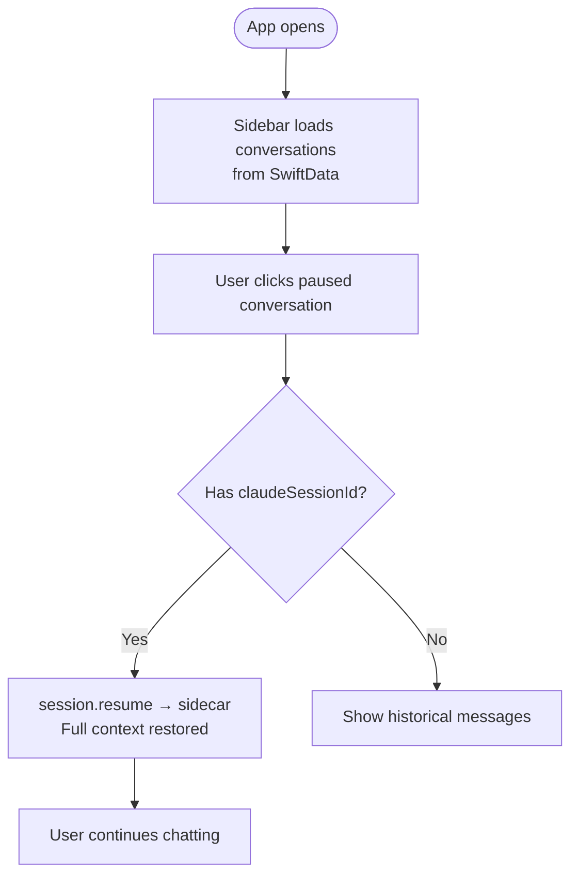

### Flow 3: Manage Conversations

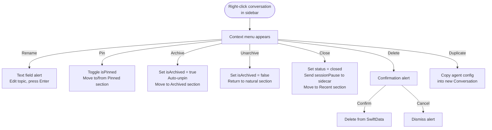

### Flow 4: Configure Settings

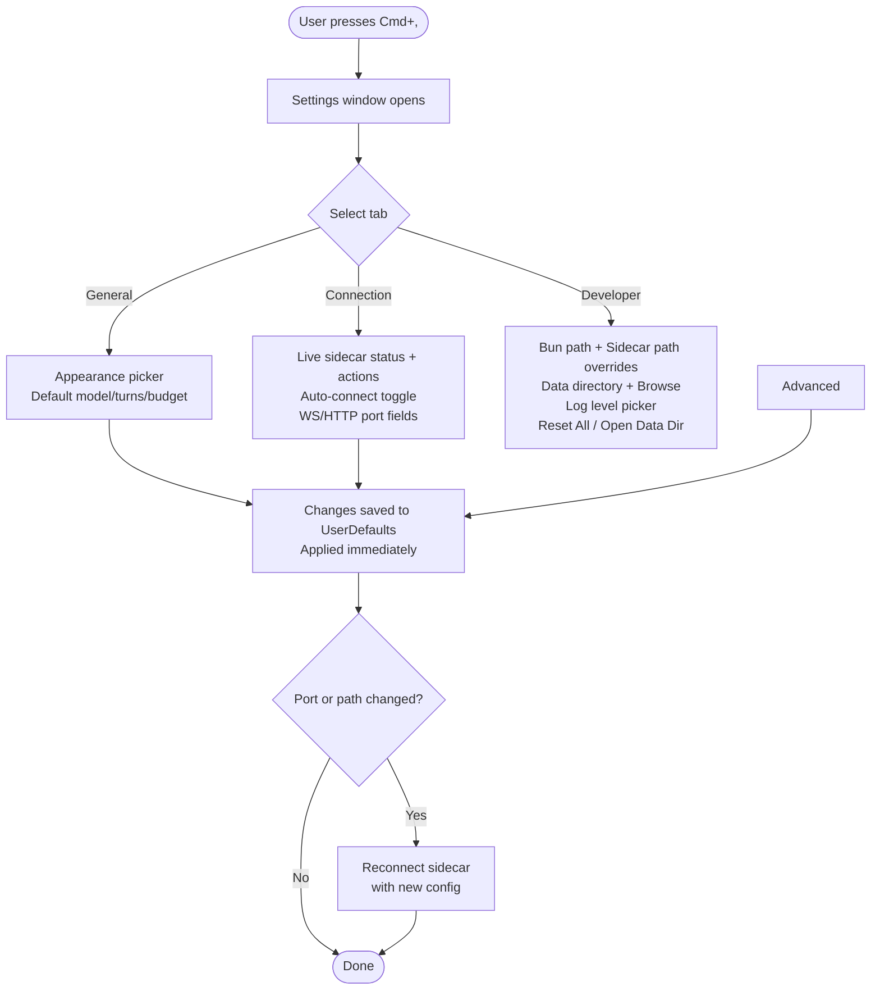

### Flow 5: Read a Markdown Response

### Flow 6: Agent-to-Agent Delegation

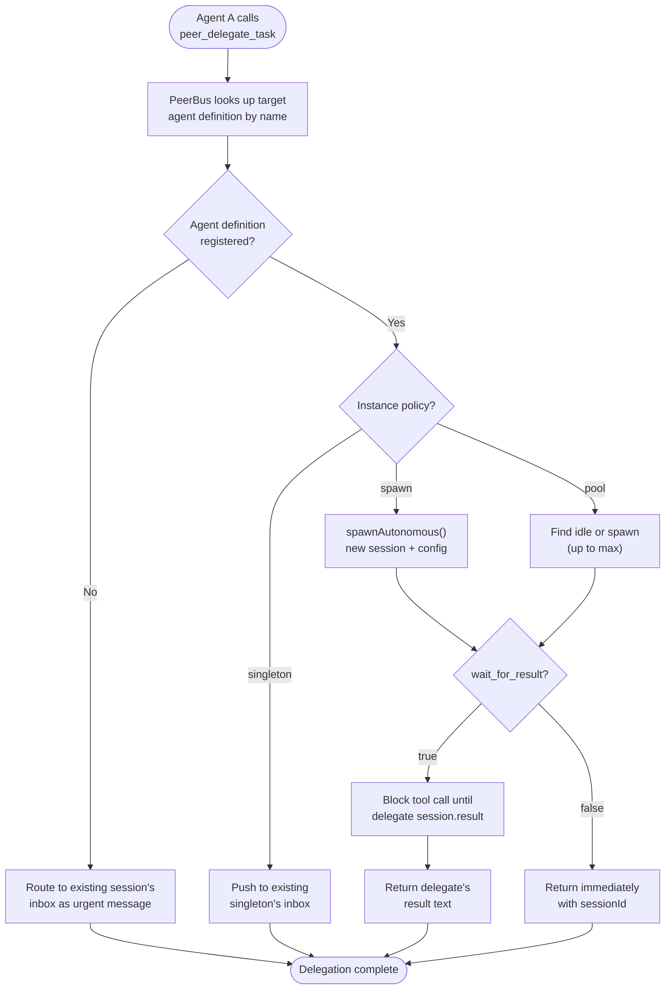

### Flow 7: Launch Named Instance

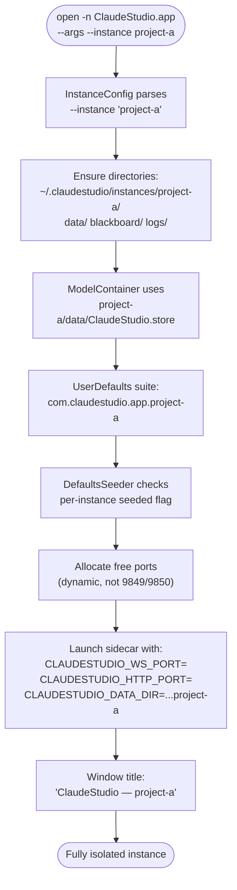

### Flow 8: Attach Files to a Message

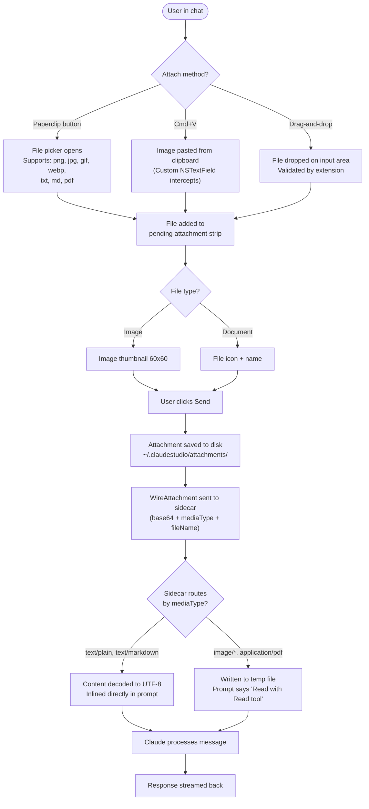

### Flow 9: Discover and Install Agent Template

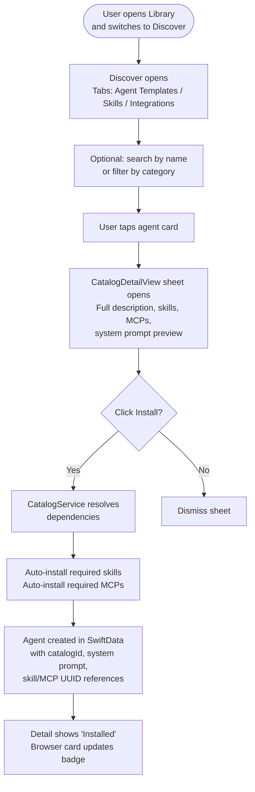

### Flow 10: Install Skill with Integration Dependencies

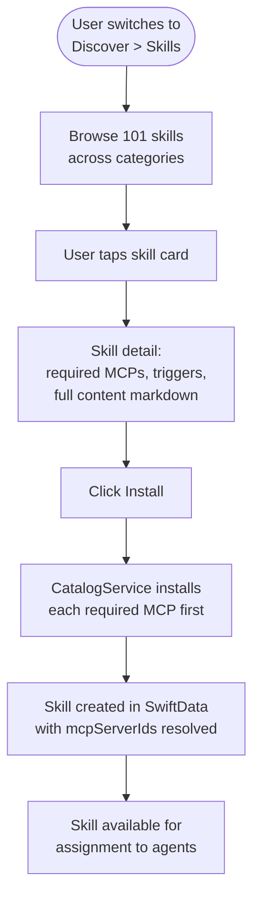

### Flow 11: Browse Agent Files in Inspector

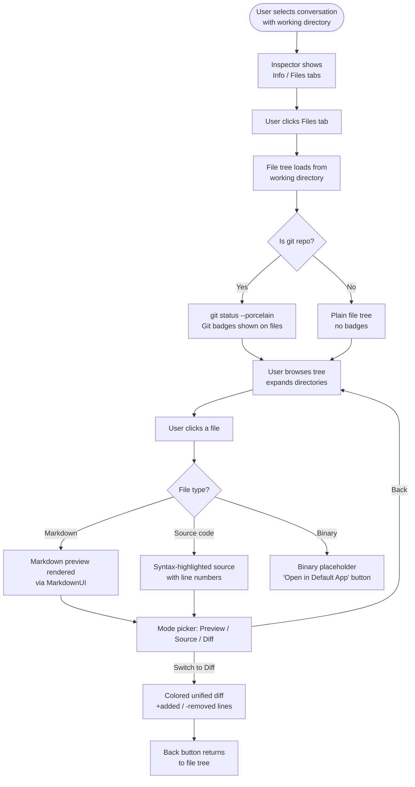

### Flow 12: User-Initiated Delegation

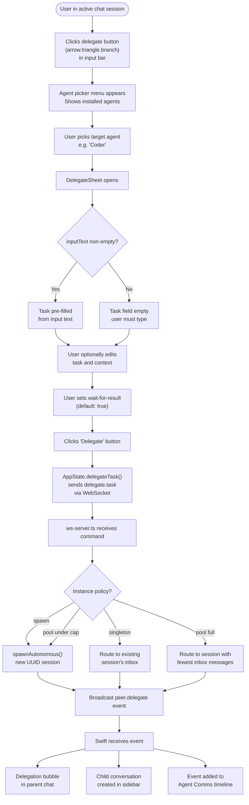

### Flow 13: Observe Agent Collaboration

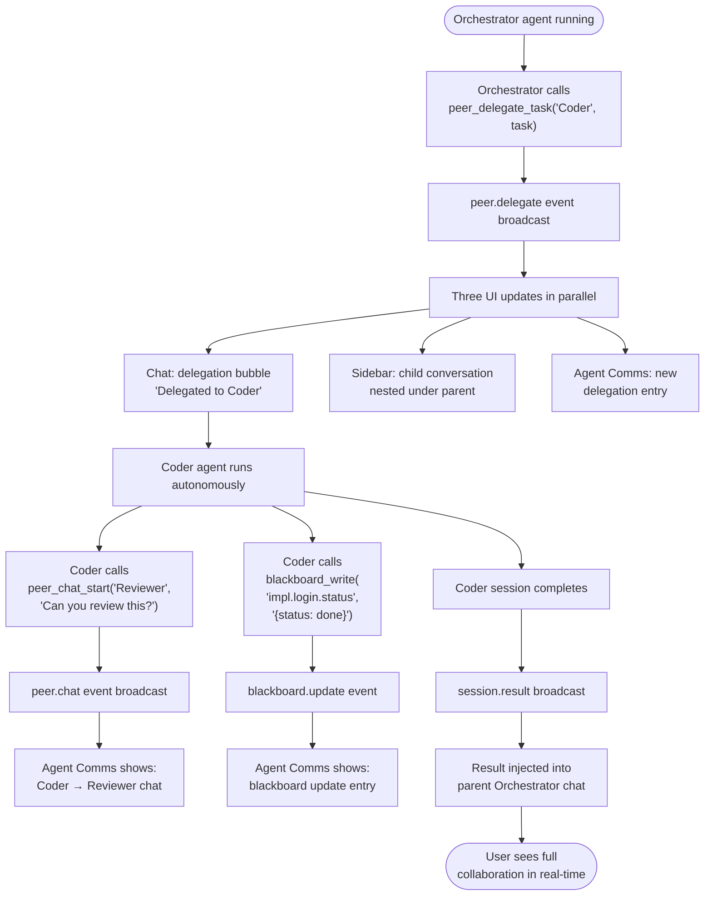

### Flow 14: GitHub workspace before first message

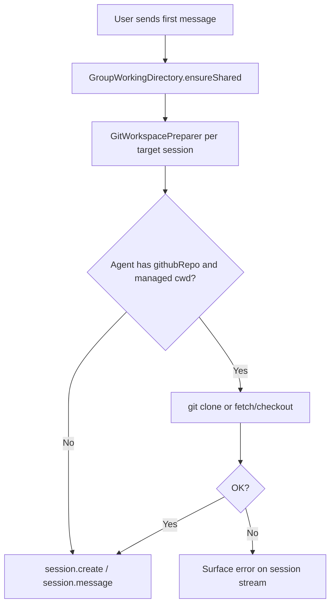

### Flow 15: New Session with GitHub clone mode

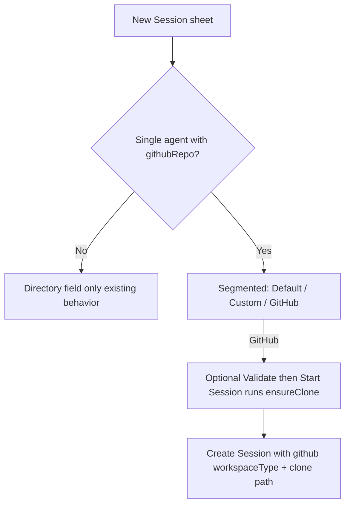

### Flow 16: LAN peer agent import

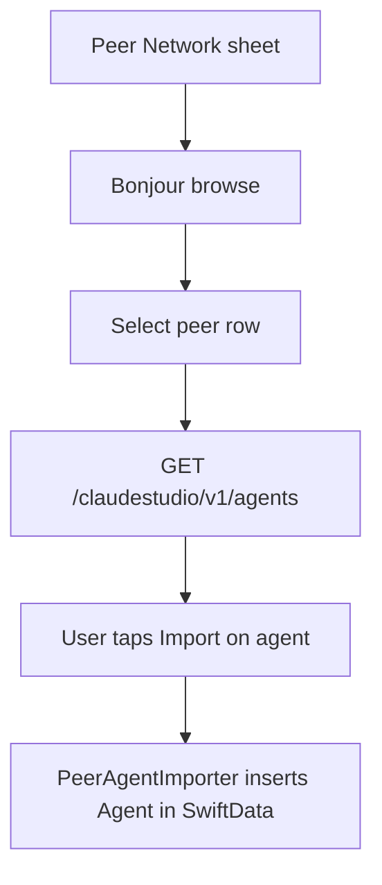

### Flow 17: Launch with CLI args or URL scheme

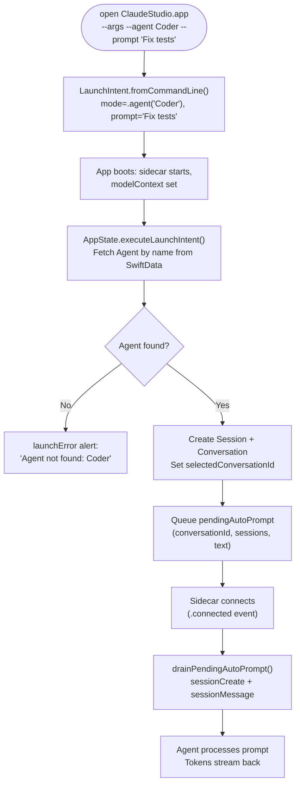

URL scheme follows the same path but enters via `onOpenURL`:

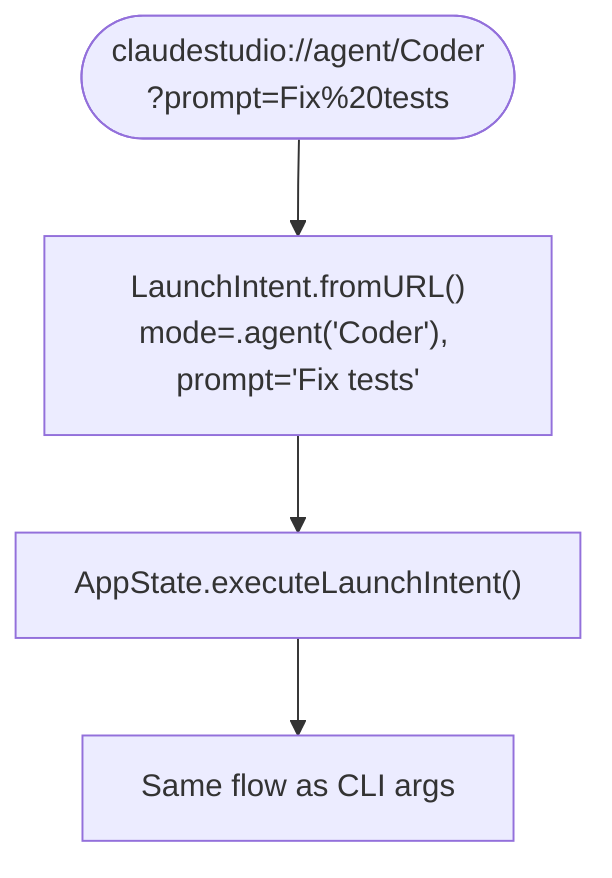

---

## 5. Non-Functional Requirements

| Requirement | Target | Status |
|---|---|---|
| macOS version | 14.0+ (Sonoma) | Met |
| Swift version | 6.0 (strict concurrency) | Met |
| Startup time | Sidecar ready within 1s | Met (~500ms) |
| Reconnect | Auto-reconnect within 5s | Met |
| Persistence | SwiftData (local, CloudKit-ready) | Met |
| Memory | Graceful with 10+ concurrent sessions | Untested |
| Security | Hardened runtime, localhost-only sidecar | Met |
| Multi-instance | Fully isolated data, ports, settings | Met |
| Test coverage | Unit tests for catalog, config, data integrity, file explorer, chat routing, group prompts, workspace resolver | Met (see CI / `xcodebuild test` + `bun test`) |
| Catalog size | 30 agents + 101 skills + 100 MCPs bundled | Met |

---

## 6. Change Log

| Date | Change | Affected |
|---|---|---|
| 2026-03-21 | Lightweight ChatHandler for simple sessions: routes sessions without tools/MCPs/skills to `claude --print` instead of full Agent SDK. Response polling in Swift saves agent replies to SwiftData. Fixed AgentLibrary sheet presentation, added indigo/gray agent colors, built-in agent loading. | FR-2.10, FR-2.14, FR-3.15-3.17, Flow 6 |
| 2026-03-21 | Rich markdown chat: MarkdownUI rendering for agent messages, code blocks with copy button, live streaming text, hover copy/timestamp, clickable links. Settings screen: three-tab preferences (General/Connection/Advanced) with dark mode, port/path overrides, reset. SidecarManager accepts configurable settings. | FR-5.18-5.25, FR-9, US-8, US-9, Flow 4, Flow 5 |
| 2026-03-21 | UX improvements: smart naming, conversation management (rename/pin/close/delete/duplicate), New Session sheet, sidebar polish (timestamps, previews, pinned section, empty state, agent icons, swipe actions), chat header enhancements (rename, close/resume, clear, model pill, cost), inspector actions (pause/resume/stop, editable topic, open in editor), agent card Start button | FR-5, FR-6, US-6, US-7, Flow 1, Flow 3 |
| 2026-03-21 | File attachments: added txt/md/pdf support alongside images. Text/markdown files inlined in prompt, images/PDFs via temp files. Generalized wire protocol from WireImageAttachment to WireAttachment. Document thumbnails with icon+name+size. Sidebar shows context-aware attachment icons. | FR-5.9, FR-10, US-9, Flow 7 |
| 2026-03-21 | Multi-instance support: InstanceConfig parses `--instance <name>`, namespaces SwiftData/blackboard/logs/UserDefaults per instance, dynamic port allocation for non-default instances, CLAUDESTUDIO_DATA_DIR env var for sidecar, window title with instance name. | FR-10, US-10, Flow 7, NFR |
| 2026-03-21 | Catalog system: directory-based catalog with 30 agents, 101 skills, 100 MCPs. CatalogService with loading, find, install/uninstall, cascading dependency resolution. CatalogBrowserView with tabs, search, category filter. CatalogDetailView with full item information, collapsible system prompt, FlowLayout triggers, install/uninstall actions. Per-agent .md system prompts. Agent → Skill → MCP hierarchy. | FR-2.15-2.18, FR-12, US-11, Flow 9, Flow 10 |
| 2026-03-29 | Intent-first library hub: replaced object-first library navigation with `Run`, `Build`, and `Discover`; groups promoted as first-class reusable teams; catalog browsing repositioned under Discover; added adaptive compact layout for narrower library sheets; added agent creation entry flow (`Create Blank` / `From Prompt`). | FR-6.22, FR-12A, FR-12.18-12.30 |
| 2026-03-21 | Test infrastructure: ClaudeStudioTests XCTest target with 61 tests covering catalog model decoding, service operations (install/uninstall/cascading/idempotent/dependency resolution), data integrity (unique IDs, valid cross-references), InstanceConfig (directories, UserDefaults, ports). Fixed catalog skill ID case mismatches across 20 agent files. Added InstanceConfig.swift to project, fixed Swift 6 concurrency warning in AppSettings. | FR-13, NFR |
| 2026-03-21 | Initial spec created from implemented codebase | All sections |
| 2026-03-21 | Phase 4: Inter-Agent Communication. Full PeerBus tool suite (17 tools) implemented as in-process MCP server injected into every Agent SDK session. Tools: blackboard_read/write/query/subscribe, peer_send_message/broadcast/receive_messages/list_agents/delegate_task, peer_chat_start/reply/listen/close/invite, workspace_create/join/list. New stores: MessageStore, ChatChannelStore (with deadlock detection), WorkspaceStore. Refactored sidecar: shared ToolContext, SessionManager accepts injected registry and context, WsServer accepts injected dependencies, agent.register command. Swift: AppState handles all peer/blackboard events, persists to SwiftData, registers agent definitions on connect. New AgentCommsView with filter tabs. Sidebar enhanced with parent-child conversation nesting and type-specific icons. Removed stale ChatHandler references from FR-3 and Flow 6. | FR-3.15-3.18, FR-4.8, FR-7.9-7.11, FR-14, FR-15, US-12, US-13, Flow 6 |
| 2026-03-22 | Phase 4.5: Built-in Ecosystem. Full first-launch seeding: DefaultsSeeder expanded from permissions-only to 5 categories (permissions, MCPs, skills, agents, templates). Created 3 system prompt templates (specialist.md, worker.md, coordinator.md) with variable resolution. Agent seeding resolves cross-entity references by name (skills, MCPs, permissions). All 30 catalog agents updated with PeerBus system skills (peer-collaboration, blackboard-patterns, agent-identity) in requiredSkills — every agent in ClaudeStudio knows how to collaborate via PeerBus. 131 Swift tests + 96 sidecar tests passing. | FR-16, US-15 |
| 2026-03-22 | Phase 6: UX Redesign + Inspector Toggle. Comprehensive UX overhaul: Settings reorganized into General/Connection (with live sidecar status and action buttons)/Developer tabs. Sidebar toolbar replaced with bottom bar (Catalog, Agents, + buttons). Main toolbar simplified to New Session + Quick Chat + status pill + inspector toggle. Chat header: tappable agent icon opens library, mission preview, Fork/Rename moved to overflow menu. Inspector transformed into monitoring dashboard with usage section (tokens, cost, turns progress bar), workspace section with Open in Terminal, and removed duplicate controls. New Session sheet: recent agents row, collapsible options DisclosureGroup, "Inherit from Agent" model default, mode tooltips. Agent Editor consolidated from 5 steps to 3 (Identity, Capabilities with Skills/MCPs/Permissions DisclosureGroups, System Prompt). Inspector toggle: toolbar button (sidebar.trailing, ⌘⌥0) shows/hides right inspector pane; chat expands to fill freed space via 2-column NavigationSplitView + HStack layout. Fixed macOS state restoration crash (WorkingDirectoryPicker environment object). Fixed FileNode Swift 6 concurrency (nonisolated init, @unchecked Sendable). | FR-6.14-6.21, FR-9.1, US-7, US-8, Flow 4 |
| 2026-03-22 | Phase 5: Inspector File Explorer. Tabbed Inspector (Info/Files) with file tree browser for agent working directories. FileSystemService, GitService, FileNode model. FileTreeView with DisclosureGroup, git badges, changes-only filter. FileContentView with three modes: Markdown preview, syntax-highlighted source (Highlightr), git diff (NSTextView). Async I/O, auto-refresh on tool calls, HighlightedCodeView for chat code blocks, dynamic git path, full a11y identifiers. | FR-17, FR-18, US-16, Flow 11 |
| 2026-03-22 | Phase 7: Agent Communication Wiring + Delegation UI. Wired AgentCommsView into MainWindowView (toolbar button with antenna icon + event badge, ⌘⇧A shortcut, sheet presentation). Added user-initiated delegation from chat: delegate menu button in input bar, agent picker menu, DelegateSheet (task editor, context field, wait-for-result toggle). New delegate.task sidecar command with full wire protocol (SidecarProtocol → ws-server.ts). Instance policy enforcement in both peer_delegate_task and delegate.task handler: singleton reuses existing session, pool caps at max then routes to least-busy, spawn always creates new. Added findByAgentName to SessionRegistry. Fixed pool serialization to pool:N format in AppState. Added peer_chat_listen to AgentProvisioner allowedTools. | FR-3.14, FR-3.19, FR-5.26-5.29, FR-14.23-14.24, FR-15.8-15.9, US-12, US-13, US-17, Flow 12, Flow 13 |
| 2026-03-22 | Phase 8: Group conversations (`Conversation.sessions`), per-session transcript watermarks, `GroupPromptBuilder` injection, sequential multi-agent sends, New Session multi-select, `/help` `/topic` `/rename` `/agents`, @-mention routing and add-on-send with autocomplete hints, fork from message + `session.fork`/`session.forked` with explicit child session id, inspector multi-session list, ⌘↩ to send / Return for newline in composer. | FR-4.9, FR-5.8, FR-5.10, FR-5.11, FR-3.11 |
| 2026-03-22 | Group chat peer fan-out: each user turn messages **all** sessions; after each assistant reply, automatic `session.message` to other agents (`Group chat: peer message`) with `GroupPeerFanOutContext` turn budget + dedup; skip fan-out to sessions still pending their user-turn message. Extended `GroupPromptBuilderTests`; sidecar E2E GC-2; docs in README, TESTING.md, AGENTS.md, CLAUDE.md. | FR-4.9, FR-5.10, NFR (tests) |
| 2026-03-22 | Phase 9: GitHub workspace (`WorkspaceResolver`, `GitHubIntegration`, `GitWorkspacePreparer`), New Session GitHub mode + Agent Editor validate/update clone, `ChatView` pre-provision clone; P2P v1 (`P2PNetworkManager`, `PeerCatalogServer`, `PeerNetworkView`, `PeerAgentImporter`, wire DTOs), toolbar ⌘⇧P; `WorkspaceResolverTests`; `xcodegen` for new Swift files. Flows 14–16, FR-19–20, US-18–19. | FR-19, FR-20, US-18, US-19, Flow 14–16, NFR |
| 2026-03-25 | Launch parameters & URL scheme: `LaunchIntent` type with CLI (`--chat`, `--agent`, `--group`, `--prompt`, `--workdir`, `--autonomous`) and `claudestudio://` URL parsers. `AppState.executeLaunchIntent()` creates session from SwiftData lookup. Auto-send prompt queued and drained on sidecar connect. `Info.plist` registers URL scheme. Error alert for missing agent/group. Combinable with `--instance`. | FR-21, US-20, Flow 17 |
| 2026-03-25 | Phase 10: Rich display tools (ask_user, render_content, show_progress, suggest_actions) as MCP injected into all sessions. Auto-expanding chat input with Shift+Enter newlines. | FR-25, FR-5 |
| 2026-03-26 | Phase 11: Task Board system. TaskItem SwiftData model, TaskBoardStore in sidecar with persistence, 4 PeerBus tools (task_board_list/create/claim/update), REST API endpoints, TaskCreationSheet and TaskEditSheet in UI, sidebar tasks section, task-board-patterns skill, wire protocol events. group_invite_agent chat tool. | FR-22, FR-26, US-21 |
| 2026-03-26 | Phase 12: Plan mode and logging. Custom plan mode via system prompt injection (not SDK plan mode). Opus override, interactive planning workflow (ask_user → show_progress → render_content → suggest_actions). Structured JSON logging in sidecar (logger.ts), Swift Log enum with OSLog, UnifiedLogEntry, LogAggregator, DebugLogView. Sidebar bottom bar refactored with SidebarBottomBarItem enum and adaptive layout. | FR-23, FR-24, US-22, US-23 |
| 2026-03-27 | Phase 13: Scheduled Missions. Added SwiftData models for schedules and run history, schedule engine + run coordinator, prompt templating, launchd sync, schedule launch intents, Schedule Library/detail/editor UI, chat/group scheduling entry points, schedule accessibility IDs, AppXray schedule smoke tests, and execution-path XCTest coverage. Also fixed catalog fallback loading for bundled `github-workflow` skill so catalog integrity and cascading install tests stay green. | FR-27, FR-12, FR-13 |
