# ClaudPeer -- System Plan & Vision

> A peer-to-peer network of AI agents, orchestrated through a native macOS app.
> Each agent is a Claude Code session with its own skills, tools, permissions, and personality.
> Agents chat with users and with each other. They share knowledge through a blackboard,
> collaborate on files through shared workspaces, and discover each other across the network.

---

## Table of Contents

1. [Architecture Overview](#1-architecture-overview)
2. [Data Model](#2-data-model)
3. [Core Concepts](#3-core-concepts)
4. [Core Services](#4-core-services)
5. [UI/UX Design](#5-uiux-design)
6. [User Flows](#6-user-flows)
7. [PeerBus Tool Reference](#7-peerbus-tool-reference)
8. [P2P Network Protocol](#8-p2p-network-protocol)
9. [Project Structure](#9-project-structure)
10. [Technical Decisions](#10-technical-decisions)
11. [Built-in Ecosystem](#11-built-in-ecosystem)
12. [Implementation Roadmap](#12-implementation-roadmap)

---

## 1. Architecture Overview

ClaudPeer is a two-process macOS app:

- **Swift UI layer** (SwiftUI + SwiftData) -- handles the user interface, persistence, and peer-to-peer networking.
- **TypeScript sidecar** (Claude Agent SDK + Bun runtime) -- manages all Claude sessions, inter-agent communication, hooks, and the blackboard.

### Why Two Processes?

The Claude Agent SDK is available in TypeScript and Python, not Swift. Rather than fighting the language boundary, we embrace it: the Swift app owns the UI and persistence (what it's best at), and the TypeScript sidecar owns the AI sessions and agent orchestration (what the SDK is best at). They communicate over a local WebSocket.

### Why Agent SDK Over CLI?

We evaluated three approaches:

| Approach | Per-turn latency | Hooks | Custom tools | Multi-turn | Complexity |
|---|---|---|---|---|---|
| CLI print-mode + resume | ~1-2s (process startup) | None | External MCP server | Via --resume per turn | Low |
| CLI interactive mode | Low | None | External MCP server | Piped stdin/stdout | Medium (TUI parsing) |
| **Agent SDK sidecar** | **Near-zero** | **Native callbacks** | **Inline tool()** | **ClaudeSDKClient** | Medium (bundled runtime) |

The Agent SDK wins because:
- **Hooks** (PreToolUse, PostToolUse, Stop) give real-time visibility into every tool call -- essential for the chat UI.
- **Custom tools** let us define PeerBus tools (peer_chat, blackboard, workspace) inline in the sidecar -- no separate MCP server process needed.
- **ClaudeSDKClient** maintains session state in-process across multiple queries -- no per-turn process startup.
- **Native subagents** via `AgentDefinition` map directly to our delegation model.
- **Session forking** is built-in for conversation branching.

### Block Diagram

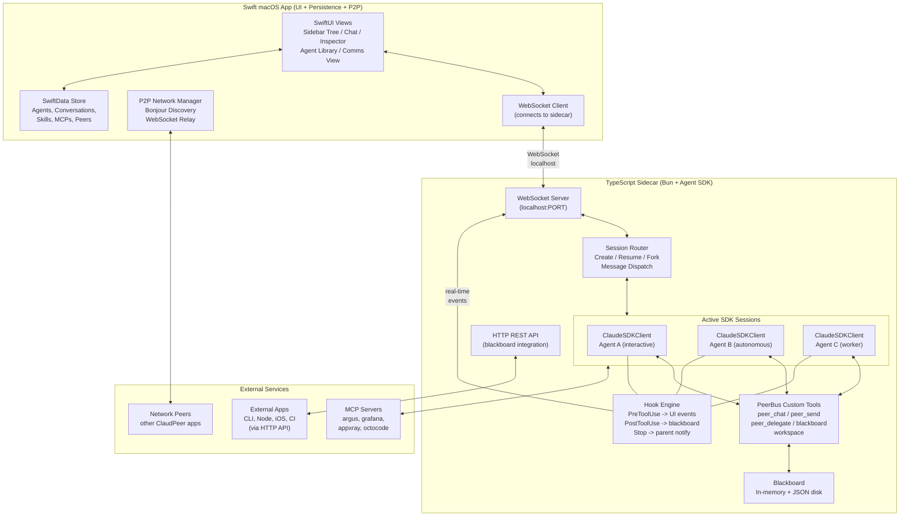

### Communication Protocol (Swift <-> Sidecar)

The WebSocket protocol uses JSON messages:

**Swift -> Sidecar (commands):**

- `{ type: "session.create", agentConfig: {...}, conversationId: "..." }` -- start a new session
- `{ type: "session.message", sessionId: "...", text: "user message" }` -- send a message to a session
- `{ type: "session.resume", sessionId: "...", claudeSessionId: "..." }` -- resume a previous session
- `{ type: "session.fork", sessionId: "..." }` -- fork a conversation
- `{ type: "session.pause", sessionId: "..." }` -- pause/kill a session
- `{ type: "agent.register", agents: [...] }` -- register agent definitions for delegation lookup
- `{ type: "peer.registry.update", peers: [...] }` -- update remote peer info (v2)

**Sidecar -> Swift (events):**

- `{ type: "stream.token", sessionId: "...", text: "..." }` -- streaming text token
- `{ type: "stream.toolCall", sessionId: "...", tool: "Read", input: {...} }` -- tool call started
- `{ type: "stream.toolResult", sessionId: "...", tool: "Read", output: {...} }` -- tool call completed
- `{ type: "session.result", sessionId: "...", result: "...", cost: 0.24 }` -- session turn completed
- `{ type: "peer.chat", channelId: "...", from: "...", message: "..." }` -- inter-agent chat message
- `{ type: "peer.delegate", from: "...", to: "...", task: "..." }` -- delegation event
- `{ type: "blackboard.update", key: "...", value: "...", writtenBy: "..." }` -- blackboard change
- `{ type: "session.error", sessionId: "...", error: "..." }` -- error
- `{ type: "route.remote", peer: "...", payload: {...} }` -- needs P2P relay (v2)

---

## 2. Data Model

### Core Entities (SwiftData)

**Agent** -- a reusable template/definition for launching sessions (like a class -- not a running instance)

- `id: UUID`
- `name: String`
- `description: String`
- `systemPrompt: String`
- `skills: [SkillRef]` -- references to skills from the pool
- `mcpServers: [MCPServerRef]` -- references to MCP servers from the pool
- `permissions: PermissionSet` -- allowed/denied tools, directories
- `model: String` -- default model (sonnet, opus, haiku)
- `maxTurns: Int?`, `maxBudget: Double?`
- `icon: String`, `color: String`
- `instancePolicy: InstancePolicy` -- `.spawn` (default), `.singleton`, `.pool(max: Int)`
- `defaultWorkingDirectory: String?` -- default cwd for sessions
- `githubRepo: String?` -- optional GitHub repo URL
- `githubDefaultBranch: String?` -- branch to clone/checkout (default: main)
- `createdAt: Date`, `updatedAt: Date`
- `origin: AgentOrigin` -- `.local`, `.peer(peerId)`, `.imported`

**Session** -- a running instance of an Agent (like an object instantiated from a class)

- `id: UUID`
- `claudeSessionId: String?` -- Claude Code's session ID for resume
- `agent: Agent` -- the agent definition used
- `mission: String?` -- the specific goal/mission for this run
- `githubIssue: String?` -- optional GitHub issue/PR URL
- `status: SessionStatus` -- `.active`, `.paused`, `.completed`, `.failed`
- `mode: SessionMode` -- `.interactive`, `.autonomous`, `.worker`
- `conversations: [Conversation]` -- all conversations this session participates in
- `workingDirectory: String` -- resolved cwd
- `workspaceType: WorkspaceType` -- `.explicit(path)`, `.agentDefault`, `.githubClone(repoUrl)`, `.ephemeral`, `.shared(workspaceId)`
- `pid: Int?` -- process ID
- `startedAt: Date`, `lastActiveAt: Date`
- `metadata: SessionMetadata` -- token usage, cost, tool calls count

**Conversation** -- the unified communication primitive (user-to-agent AND agent-to-agent are the same thing)

- `id: UUID` (also serves as channel_id for PeerBus tools)
- `topic: String?`
- `participants: [Participant]` -- 2+ participants (supports group chats)
- `messages: [ConversationMessage]` -- ordered: `{ sender, text, timestamp, type }`
- `parentConversation: UUID?` -- if spawned from another conversation (enables tree view)
- `status: ConversationStatus` -- `.active`, `.closed`
- `isPinned: Bool` -- pinned to top of sidebar
- `isArchived: Bool` -- hidden from main sections, shown in collapsible Archived section (orthogonal to status)
- `summary: String?` -- optional summary written on close
- `startedAt: Date`, `closedAt: Date?`

**Participant** -- a member of a conversation

- `type: ParticipantType` -- `.user` or `.agentSession(sessionId)`
- `displayName: String`
- `role: ParticipantRole` -- `.active` (can send), `.observer` (read-only)

**SharedWorkspace** -- a shared directory multiple agents can access

- `id: UUID`
- `name: String`
- `path: String` -- `~/.claudpeer/workspaces/{id}/`
- `participants: [SessionRef]`
- `createdAt: Date`

**BlackboardEntry** -- a key-value entry in the shared blackboard

- `id: UUID`
- `key: String` -- namespaced key (e.g. "research.sorting_results")
- `value: String` -- JSON-encoded value
- `writtenBy: String` -- session/agent that wrote it
- `workspaceId: UUID?` -- optional scoping to a shared workspace
- `createdAt: Date`, `updatedAt: Date`

**Skill** -- a managed skill in the pool

- `id: UUID`
- `name: String`, `description: String`, `category: String`
- `content: String` -- the full SKILL.md markdown
- `triggers: [String]`
- `source: SkillSource` -- `.filesystem(path)`, `.peer(peerId)`, `.builtin`
- `version: String`

**MCPServer** -- a managed MCP server in the pool

- `id: UUID`
- `name: String`, `description: String`
- `transport: MCPTransport` -- `.stdio(command, args, env)`, `.http(url, headers)`
- `tools: [MCPToolDescriptor]` -- cached tool schemas
- `resources: [MCPResourceDescriptor]`
- `status: MCPStatus` -- `.available`, `.connected`, `.error`

**PermissionSet** -- reusable permission presets

- `id: UUID`
- `name: String` -- e.g. "Read Only", "Full Access", "Web Dev"
- `allowRules: [String]` -- e.g. `["Read", "Bash(git *)", "mcp__argus__inspect"]`
- `denyRules: [String]`
- `additionalDirectories: [String]`
- `permissionMode: String` -- "default", "plan", "bypassPermissions"

**Peer** -- a discovered network peer

- `id: UUID`
- `displayName: String`
- `hostName: String`
- `lastSeen: Date`
- `sharedAgents: [AgentSummary]`
- `status: PeerStatus`

### Entity Relationships

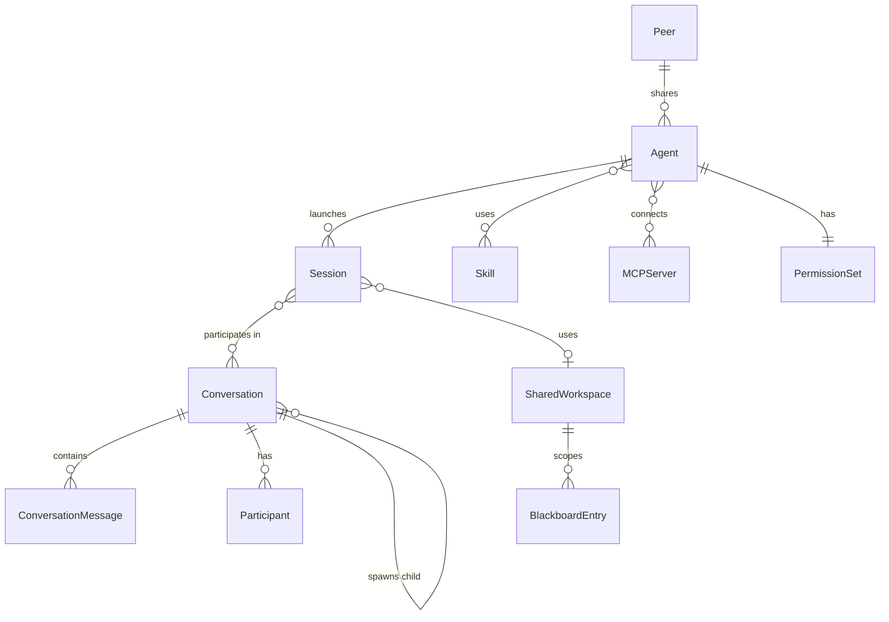

---

## 3. Core Concepts

### 3.1 The Unified Conversation Model

A key design insight: **user-to-agent and agent-to-agent communication are the same abstraction**. Both are conversations between participants. The only difference is the transport:

- **User-to-Agent**: user types in UI -> message goes to Claude SDK -> response streamed back
- **Agent-to-Agent**: agent calls `peer_chat` tool -> PeerBus routes -> other agent sees it via inbox

This means:
- One `Conversation` model handles all cases
- A `Participant` is either `.user` or `.agentSession(id)`
- Group chats (User + Agent1 + Agent2) are natural
- The Chat UI renders any conversation identically

An agent can participate in multiple conversations in parallel (one with the user, one with Agent B, one with Agent C). Since Claude Code is single-threaded, the agent interleaves between them -- but from the UI perspective, they appear as parallel conversations.

### 3.2 Instance Lifecycle (Agent = Template, Session = Instance)

Agent definitions are templates (like classes). Sessions are instances (like objects). The `instancePolicy` on the Agent determines what happens when someone wants to interact with that agent type:

| Trigger | `.spawn` (default) | `.singleton` | `.pool(max: N)` |
|---|---|---|---|
| User clicks "Start" | New session (interactive) | Reuse running or start new | New session (up to N) |
| Agent delegates via `peer_delegate_task` | New session (autonomous) | Queue to inbox of running instance | Reuse idle or spawn (up to N) |
| Network peer requests | New session (autonomous) | Queue to inbox | Reuse idle or spawn (up to N) |
| User resumes from sidebar | Resume existing session | Resume the singleton | Resume specific instance |

**Session modes:**

- `.interactive` -- user is actively chatting. Created when user starts or resumes a session.
- `.autonomous` -- running a delegated task with no user input. Created by `peer_delegate_task`. Reports results back to parent. User can observe it in the sidebar.
- `.worker` -- long-lived singleton processing its inbox sequentially. System prompt includes instructions to poll `peer_receive_messages()` between tasks.

**Delegation flow:**

When Agent A calls `peer_delegate_task(to: "Code Writer", task: "...", wait_for_result: true/false)`:

1. Sidecar looks up the "Code Writer" agent definition
2. Checks its `instancePolicy`:
   - `.spawn` -> start a new session with the task as initial prompt, mode = `.autonomous`
   - `.singleton` -> if running, queue task to its inbox; if not, start one with mode = `.worker`
   - `.pool(max)` -> find idle instance or spawn new (up to max), queue task
3. If `wait_for_result: true` -> the PeerBus blocks Agent A's tool call until the delegate finishes
4. If `wait_for_result: false` -> returns immediately with the delegate's session ID

**Parent-child tracking:** Autonomous sessions store `parentSession` so the UI can show the delegation tree (Agent A spawned Agent B which spawned Agent C). The sidebar groups child sessions under their parent.

### 3.3 Three-Layer Information Sharing

Agents share information through three complementary channels:

**Layer 1 -- Message Bus** (real-time coordination)

Two modes: async fire-and-forget (`peer_send_message`, `peer_broadcast`) and blocking conversational chat (`peer_chat_start`, `peer_chat_reply`). Agents choose per interaction.

- Async is for "I'm done", "here's what I found" -- no waiting
- Blocking chat is for back-and-forth: "which algorithm?", "how much memory?", "mergesort it is"

**Layer 2 -- Shared Workspace** (file artifacts)

A shared directory (`~/.claudpeer/workspaces/{id}/`) that multiple agents can read/write to using standard Read/Write tools. For code, reports, data files. Created with `workspace_create`, joined with `workspace_join`.

**Layer 3 -- Blackboard** (structured knowledge)

A shared key-value store where agents write structured findings and read each other's results. Decoupled -- no need to know who wrote or who will read.

```
Blackboard State:
  research.top3              = ["quicksort", "mergesort", "heapsort"]  (by: Researcher)
  research.memory_budget     = "8GB"                                    (by: Researcher)
  implementation.mergesort   = {status: "done", file: "mergesort.swift"} (by: Coder)
  review.mergesort           = {approved: true}                          (by: Reviewer)
  pipeline.phase             = "review"                                  (by: System)
```

Agents query it:
- `blackboard_read("research.top3")` -> specific value
- `blackboard_query("implementation.*")` -> all implementation entries
- `blackboard_subscribe("review.*")` -> get notified when any review changes

**Why three layers?** Each solves a different problem:
- Messages for coordination ("I'm done, your turn")
- Workspace for artifacts (code, documents, data files)
- Blackboard for structured knowledge (findings, decisions, status)

An agent can use any combination. A simple delegation might only use messages. A complex pipeline uses all three.

### 3.4 The Blackboard in Detail

The Blackboard is implemented in the TypeScript sidecar as:

1. **In-memory Map** for fast reads/writes during a session
2. **Persisted to JSON file** (`~/.claudpeer/blackboard/{workspace-id}.json`) so it survives restarts
3. **Exposed as custom SDK tools** that agents call like any other tool
4. **Event-emitting** -- every write sends a `blackboard.update` WebSocket event to Swift UI, and notifies subscribing agents

**External Integration (HTTP REST API):**

The sidecar exposes a lightweight HTTP API on localhost, enabling any local application to participate:

- `POST /blackboard/write` -- write a key-value entry
- `GET /blackboard/read?key=...` -- read a single entry
- `GET /blackboard/query?pattern=...` -- query by glob pattern
- `GET /blackboard/keys?scope=...` -- list all keys
- `WS /blackboard/subscribe?pattern=...` -- WebSocket stream of changes
- `GET /blackboard/health` -- health check

This turns ClaudPeer into an integration hub. CLI scripts can feed data to agents, Node.js apps can subscribe to changes, iOS companion apps can fetch results, CI pipelines can trigger work and read outcomes.

Access control (v1): localhost only (127.0.0.1), no auth. Future (v2): expose as MCP server for Claude Desktop and other AI tools.

### 3.5 Working Directories

Each agent session needs a working directory. The WorkspaceResolver resolves it by priority:

1. **Explicit path** -- user picks a directory when starting the session
2. **GitHub clone** -- if agent has `githubRepo`, clone to `~/.claudpeer/repos/{owner}-{repo}/`. If session has `githubIssue`, create a feature branch
3. **Agent default** -- agent's `defaultWorkingDirectory` if set
4. **Shared workspace** -- if session joins a collaboration, use `~/.claudpeer/workspaces/{id}/`
5. **Ephemeral sandbox** -- fallback: create `~/.claudpeer/sandboxes/{session-id}/`

GitHub integration: when `githubRepo` is set, auto-adds `Bash(gh *)` and `Bash(git *)` to allowedTools. System prompt is appended with repo/issue context. The `gh` CLI handles all GitHub operations natively.

---

## 4. Core Services

### 4.1 Sidecar: Session Manager (TypeScript)

Manages Claude Agent SDK sessions:

- **Create**: Instantiates `ClaudeSDKClient` with agent config (allowedTools, mcpServers, hooks, custom tools, systemPrompt, cwd)
- **Message**: Calls `client.query(prompt)` and streams typed messages back to Swift
- **Resume**: Uses `resume: claudeSessionId` to reconnect with full context
- **Fork**: Uses `forkSession: true` to branch a conversation
- **Pause**: Gracefully stops, captures session_id for later resume
- **Parallel**: Multiple `ClaudeSDKClient` instances concurrently

```typescript
async function createSession(agentConfig: AgentConfig, conversationId: string) {
  const client = new ClaudeSDKClient({
    allowedTools: [...agentConfig.permissions.allow, "peer_chat_start", "blackboard_read", ...],
    mcpServers: agentConfig.mcpServers,
    hooks: buildHooks(conversationId),
    tools: peerBusTools,
    agents: buildSubagentDefs(agentConfig),
    systemPrompt: agentConfig.systemPrompt,
    cwd: agentConfig.workingDirectory,
  });
  sessions.set(conversationId, client);
}
```

### 4.2 Sidecar: Hook Engine (TypeScript)

Every agent session gets these hooks:

- **PreToolUse** -- fires before any tool call. Sends `stream.toolCall` event to Swift UI. Can block dangerous operations.
- **PostToolUse** -- fires after tool completion. Sends `stream.toolResult`. Auto-updates blackboard with agent activity.
- **Stop** -- fires when agent finishes. Notifies parent conversation.
- **SessionStart** -- fires on creation. Registers with PeerBus.
- **UserPromptSubmit** -- fires before each prompt. Injects latest inbox messages.

### 4.3 Sidecar: PeerBus Custom Tools (TypeScript)

The PeerBus is a set of custom SDK tools defined inline using the Agent SDK's `tool()` helper. Every session gets these tools injected. Implementations run in-process with direct access to all sessions, the blackboard, and the WebSocket to Swift.

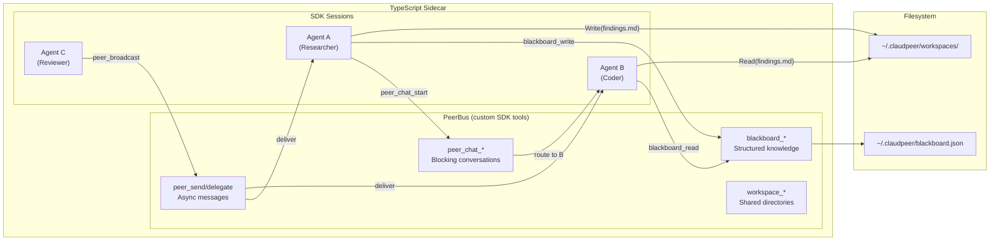

See [Section 7: PeerBus Tool Reference](#7-peerbus-tool-reference) for the full tool API.

### 4.4 Sidecar: Blackboard HTTP API (External Integration)

The sidecar exposes a lightweight HTTP REST API alongside its WebSocket server:

**Endpoints (all on localhost):**

- `POST /blackboard/write` -- write a key-value entry (body: `{ key, value, writtenBy?, scope? }`)
- `GET /blackboard/read?key=...` -- read a single entry
- `GET /blackboard/query?pattern=...` -- query entries by glob pattern
- `GET /blackboard/keys?scope=...` -- list all keys, optionally scoped
- `WS /blackboard/subscribe?pattern=...` -- WebSocket stream of changes matching pattern
- `GET /blackboard/health` -- health check / session count

External writes trigger the same events as agent writes. External tools appear as named writers (e.g. `writtenBy: "ci-pipeline"`).

**Access control (v1):** localhost only (bound to 127.0.0.1). No auth needed since it's local. Optionally configurable port in app settings.

**Future (v2):** Expose as MCP server so Claude Desktop, VS Code extensions, and other AI tools can plug into the blackboard natively.

### 4.5 Swift: Agent Provisioner

Composes an `AgentConfig` from building blocks and sends it to the sidecar:

- Resolves working directory via WorkspaceResolver
- Validates skill/MCP compatibility
- Builds `mcpServers` dict from selected MCPs
- Builds `systemPrompt` from base prompt + skill content + repo/issue context
- Builds `allowedTools` array from permission set
- Resolves `instancePolicy` for delegation routing
- Sends config to sidecar via `session.create` WebSocket message

### 4.6 Swift: WorkspaceResolver

Resolves the working directory for a session based on priority:

1. **Explicit path** -- user picks a directory when starting the session
2. **GitHub clone** -- if agent has `githubRepo`, clone to `~/.claudpeer/repos/{owner}-{repo}/` (or pull if already cloned). If session has `githubIssue`, create a feature branch
3. **Agent default** -- agent's `defaultWorkingDirectory` if set
4. **Shared workspace** -- if session joins a collaboration, use `~/.claudpeer/workspaces/{id}/`
5. **Ephemeral sandbox** -- fallback: create `~/.claudpeer/sandboxes/{session-id}/`

GitHub integration: when `githubRepo` is set, auto-adds `Bash(gh *)` and `Bash(git *)` to allowedTools. System prompt is appended with repo context.

### 4.7 Swift: P2P Network Manager

Handles multi-user networking (lives in the Swift app, not the sidecar):

- **Discovery**: Bonjour/mDNS service type `_claudpeer._tcp`
- **Sync**: WebSocket protocol for sharing agent definitions (JSON export/import)
- **Relay** (v2): Routes cross-machine agent messages through the sidecar's PeerBus
- **Cross-machine blackboard** (v2): Optionally sync blackboard entries between peers

---

## 5. UI/UX Design

### 5.1 Main Window -- Three-Panel Layout

Uses SwiftUI `NavigationSplitView` with three columns:

```
+-------------------+-----------------------------------+-------------------+
|    SIDEBAR        |          CHAT AREA                |    INSPECTOR      |
|   (260px)         |         (flexible)                |    (280px)        |
|                   |                                   |                   |
| [+ New Chat]      | Research Task        [+add] [||]  | CONVERSATION      |
|                   | you + ResearchBot                 | Participants: 2   |
| ACTIVE            | Mission: Analyze Q4 data          | ResearchBot: sonnet|
| > Research Task   |                                   | Started: 2m ago   |
| | > RBot <-> Coder| ================================= | Tokens: 12,450   |
| | | > Coder<->Rev | You: Can you look at the Q4       | Cost: $0.24      |
| | > RBot <-> Anlst|   revenue data and find trends?   |                   |
| > Group Debug     |                                   | CHILD CONVOS (2)  |
| | > Bug <-> Logger| ResearchBot: I'll analyze the Q4  | > RBot <-> Coder  |
| > Daily Worker    |   data. Let me start by reading   |   (active)        |
|                   |   the relevant files...           | > RBot <-> Analyst|
| RECENT            |                                   |   (active)        |
| > API Design done | [Tool: Read] sales_q4.csv         |                   |
| > Bug Fix #42 done|   > 2,450 rows loaded             | ACTIVE TOOLS      |
|                   |                                   | [x] Read          |
| STARRED           | [Agent Chat: RBot <-> Coder]      | [x] Bash          |
| > Daily Standup   |   "Discussing algorithm choice"   | [x] mcp__argus    |
|                   |   (click to expand)               |                   |
| ----------------  |                                   | SKILLS (3)        |
| AGENTS            | ResearchBot: Based on the data    | - data-analysis   |
| > Research Bot    |   and my discussion with Coder,   | - web-search      |
| > Code Writer [1] |   here are three key trends...    | - mermaid-diagrams|
| > Bug Fixer       |                                   |                   |
| > Reviewer [3]    | [streaming...]                    | MCPs (2)          |
| [Manage Agents]   |                                   | - grafana [ok]    |
|                   | ================================= | - argus [ok]      |
|                   | +--------------------------------+|                   |
|                   | | Type a message...         [>] ||                   |
|                   | +--------------------------------+|                   |
+-------------------+-----------------------------------+-------------------+
```

### 5.2 Sidebar -- Conversation Tree

The sidebar organizes all conversations as a tree. User conversations are roots, agent-spawned conversations are nested children. Clicking any node opens that conversation in the chat area.

```
ACTIVE
 > [user+bot] Research Task                   you + ResearchBot
 |   > [bot<->bot] ResearchBot <-> Coder      spawned from above
 |   |   > [bot<->bot] Coder <-> Reviewer     spawned from Coder chat
 |   > [bot<->bot] ResearchBot <-> Analyst    another branch
 > [user+bots] Group Debug Session            you + BugFixer + Tester
 |   > [bot<->bot] BugFixer <-> Logger
 > [bot] Daily Worker                         singleton (no user conversation)

RECENT
 > [user+bot] API Design (completed)
 |   > [bot<->bot] Designer <-> Reviewer

STARRED
 > [user+bot] Daily Standup

AGENTS
 > Research Bot
 > Code Writer [1]           <-- singleton badge
 > Bug Fixer
 > Reviewer [3]              <-- pool(3) badge
 [Manage Agents]
```

Legend:
- `[user+bot]` = user conversation with one agent
- `[user+bots]` = group conversation with user + multiple agents
- `[bot<->bot]` = agent-to-agent conversation
- `[bot]` = standalone agent worker
- Indentation shows spawn tree
- Status: green dot = active, grey = paused, checkmark = completed

### 5.3 Chat Area

The chat area displays any selected conversation -- whether user-to-agent, agent-to-agent, or group.

- Header: Conversation participants + topic + control buttons (pause, stop, fork, add participant)
- Messages: All participants shown with distinct colors/avatars. User messages, agent messages, and tool call blocks all in one unified timeline.
- For **group chats**: each agent's messages have a distinct color. User can @-mention specific agents or send to all.
- For **agent-to-agent conversations**: user sees the full exchange in read-only mode (can inject a message to join if needed)
- Streaming indicator with per-agent token/cost counters
- Input: Rich text field with `/` slash commands, file drag-and-drop, `@agent-name` mentions in group chats
- Message actions: copy, retry, fork from here
- Inline display of inter-agent communication as collapsible tool call blocks

### 5.4 Agent Library (Sheet/Window)

```
+-----------------------------------------------------------------------+
|  AGENT LIBRARY                                           [+ New Agent] |
|                                                                        |
|  [Search agents...]                    Filter: [All] [Mine] [Shared]  |
|                                                                        |
|  +------------------+  +------------------+  +------------------+      |
|  | Research Bot      |  | Code Reviewer    |  | Bug Fixer        |     |
|  | "Analyzes data    |  | "Reviews PRs     |  | "Systematic      |     |
|  |  and generates    |  |  with security   |  |  debugging and   |     |
|  |  insights"        |  |  focus"          |  |  fix workflow"   |     |
|  |                   |  |                   |  |                  |     |
|  | Skills: 3         |  | Skills: 2         |  | Skills: 4        |     |
|  | MCPs: 2           |  | MCPs: 1           |  | MCPs: 3          |     |
|  | Perms: Standard   |  | Perms: Read-Only  |  | Perms: Full      |     |
|  |                   |  |                   |  |                  |     |
|  | [Start] [Edit]    |  | [Start] [Edit]    |  | [Start] [Edit]   |     |
|  | origin: local     |  | origin: peer-A    |  | origin: local    |     |
|  +------------------+  +------------------+  +------------------+      |
+-----------------------------------------------------------------------+
```

### 5.5 Agent Editor (Sheet)

A multi-step form for creating/editing agents:

**Step 1: Identity + Workspace**

```
+-----------------------------------------------------------------------+
|  CREATE AGENT                                                          |
|                                                                        |
|  [1.Identity] [2.Skills] [3.MCPs] [4.Permissions] [5.System Prompt]   |
|  ============                                                          |
|                                                                        |
|  Name:  [Research Bot_____________]                                    |
|  Desc:  [Analyzes data and generates insights___________]             |
|  Icon:  [magnifyingglass]  Color: [blue]                              |
|  Model: [sonnet v] Max turns: [50] Budget: [$5.00]                   |
|                                                                        |
|  -- Instance Policy --                                                 |
|  Policy: (o) Spawn fresh per task (default)                            |
|          ( ) Singleton (one instance, tasks queue to inbox)            |
|          ( ) Pool  Max instances: [3]                                  |
|                                                                        |
|  -- Workspace --                                                       |
|  Working Dir:  [~/projects/data-analysis] [Browse]                     |
|               (leave empty for ephemeral sandbox)                      |
|  GitHub Repo:  [https://github.com/user/repo____] [Verify]            |
|  Branch:       [main__________]                                        |
|               (auto-clones repo, adds gh CLI permissions)              |
|                                                                        |
|                                            [Cancel]  [Next ->]         |
+-----------------------------------------------------------------------+
```

**Step 2: Skills** -- dual-pane drag-and-drop from pool (search, categorize)

**Step 3: MCPs** -- select from pool, add custom servers

**Step 4: Permissions** -- presets (Read-Only, Standard, Full) or custom allow/deny rules

**Step 5: System Prompt** -- template selection or custom editor with token count and preview

### 5.6 Agent Comms View

Unified timeline of all inter-agent communication across the three channels:

```
+-----------------------------------------------------------------------+
|  AGENT COMMS                                    [Filter v] [Pause]     |
|                                                                        |
|  [All] [Chats] [Messages] [Delegations] [Blackboard]                 |
|                                                                        |
|  12:04:32  CHAT  Researcher <-> Coder                                 |
|  Topic: "Algorithm selection"                                          |
|  > Researcher: I found 3 sorting algorithms...                        |
|  > Coder: How much memory can we use?                                 |
|  > Researcher: We have 8GB available.                                 |
|  > Summary: Decided on mergesort. 8GB memory budget.                  |
|                                                                        |
|  12:04:28  DELEGATE  Researcher -> Coder                              |
|  Task: "Implement mergesort with external merge"                       |
|  Status: running (autonomous session #3)          [View Session]       |
|                                                                        |
|  12:04:25  MESSAGE  Coder -> Researcher                               |
|  "Implementation complete: mergesort.swift written"                    |
|                                                                        |
|  12:04:20  BLACKBOARD  Researcher wrote research.top3                 |
|  Value: ["quicksort", "mergesort", "heapsort"]                        |
|                                                                        |
|  12:04:15  BROADCAST  Reviewer -> #status                             |
|  "Review complete -- all implementations approved"                     |
+-----------------------------------------------------------------------+
```

Each entry is clickable -- chats expand to show full conversation, delegations link to the child session, blackboard entries show the full value.

### 5.7 P2P Network Panel

```
+-----------------------------------------------------------------------+
|  PEER NETWORK                                              [Settings]  |
|                                                                        |
|  My Identity: Shay's MacBook Pro                                      |
|  Status: Broadcasting on _claudpeer._tcp                              |
|  Sharing: 5 agents, 12 skills                                        |
|                                                                        |
|  DISCOVERED PEERS (2)                                                  |
|  [avatar] Alex's Mac Mini          Last seen: now                     |
|           Sharing: 3 agents, 8 skills                                 |
|           [Browse Agents]  [Browse Skills]  [Request Agent]           |
|                                                                        |
|  [avatar] Jordan's MacBook Pro     Last seen: 2m ago                  |
|           Sharing: 7 agents, 15 skills                                |
|           [Browse Agents]  [Browse Skills]  [Request Agent]           |
|                                                                        |
|  CROSS-MACHINE SESSIONS (1 active)  -- v2 --                         |
|  "Joint Code Review" -- Alex + Shay                                   |
|   Alex's ReviewBot <--> Shay's CodeAnalyzer                           |
|   Status: Agents collaborating on PR #142                             |
|   [View Chat]  [Disconnect]                                           |
+-----------------------------------------------------------------------+
```

---

## 6. User Flows

### 6.1 Create Agent and Start Conversation

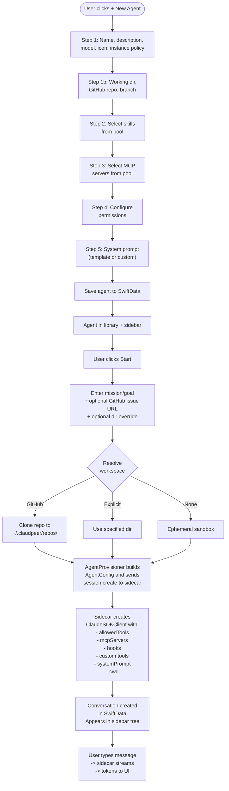

### 6.2 Resume Conversation After App Restart

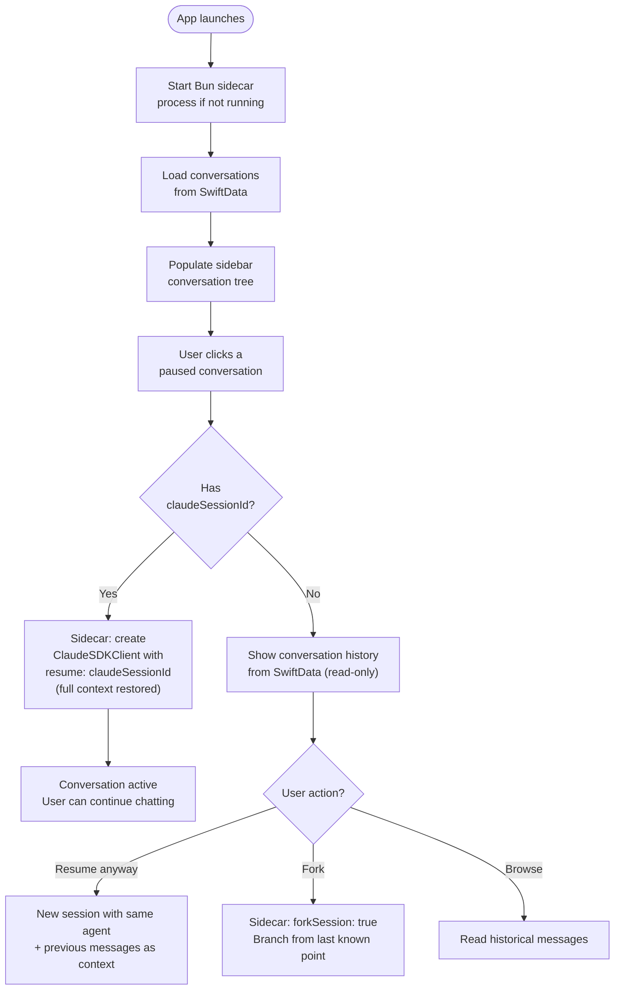

### 6.3 Agent-to-Agent Chat (Blocking Conversation)

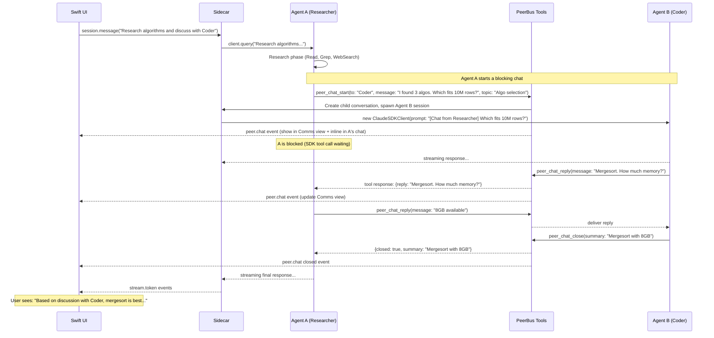

### 6.4 Three-Layer Collaboration Pipeline

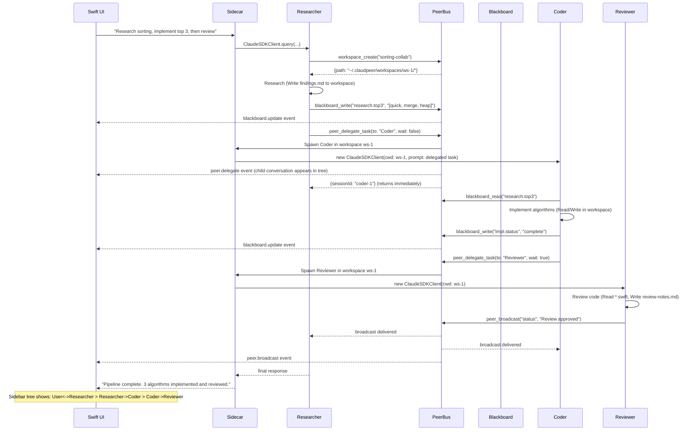

### 6.5 Group Conversation (User + Multiple Agents)

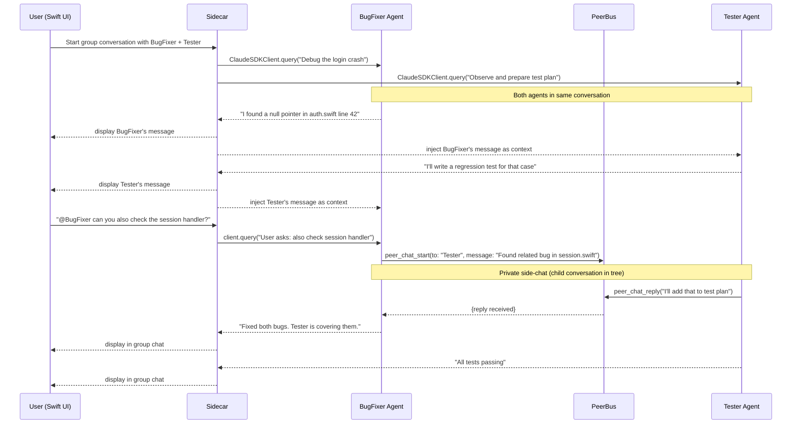

### 6.6 P2P Agent Sharing (v1)

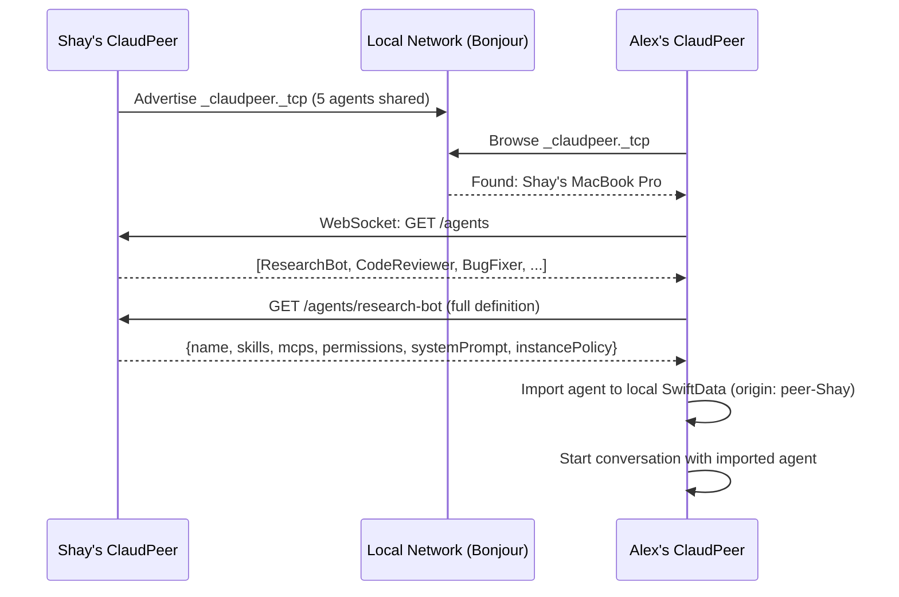

### 6.7 Cross-Machine Agent Collaboration (v2)

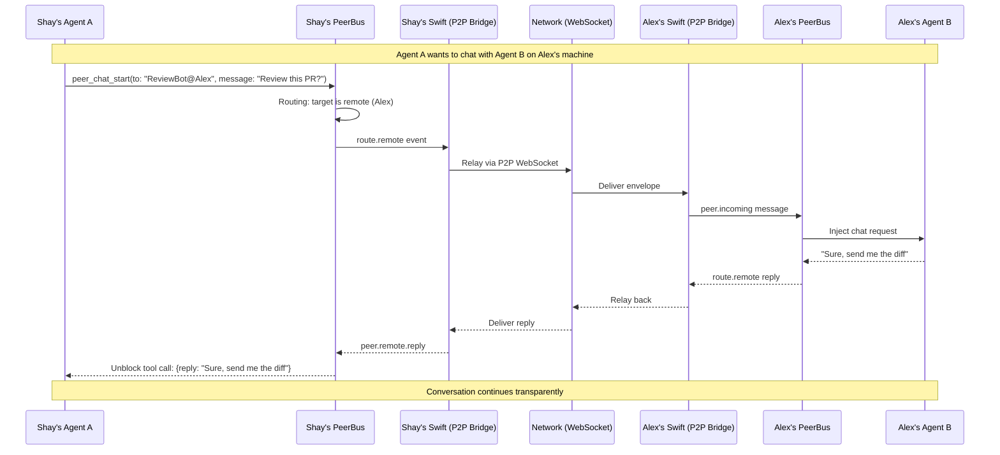

---

## 7. PeerBus Tool Reference

### Layer 1a: Async Message Bus Tools

For sending information without waiting -- status updates, notifications, results.

```json
{
  "peer_send_message": {
    "description": "Send a direct async message to another agent. Returns immediately.",
    "parameters": {
      "to_agent": "string (agent session ID or name)",
      "message": "string",
      "priority": "string (normal|urgent)"
    }
  },
  "peer_delegate_task": {
    "description": "Delegate a task to another agent. Behavior depends on target's instancePolicy.",
    "parameters": {
      "to_agent": "string (agent definition name)",
      "task": "string (task description)",
      "context": "string (relevant context/data)",
      "wait_for_result": "boolean (true = block until done; false = return session ID)"
    }
  },
  "peer_receive_messages": {
    "description": "Check inbox for async messages and chat requests from other agents",
    "parameters": {
      "since": "string (ISO timestamp, optional)"
    }
  },
  "peer_list_agents": {
    "description": "List all running and available agents (local + remote in v2)",
    "parameters": {}
  },
  "peer_broadcast": {
    "description": "Broadcast a message to all agents subscribed to a channel",
    "parameters": {
      "channel": "string (e.g. 'status', 'findings')",
      "message": "string"
    }
  }
}
```

### Layer 1b: Blocking Chat Tools

For real back-and-forth dialogue between agents. The tool **blocks** until the other agent replies.

```json
{
  "peer_chat_start": {
    "description": "Start a conversation with another agent. Sends first message and BLOCKS until reply.",
    "parameters": {
      "to_agent": "string",
      "message": "string (opening message)",
      "topic": "string (optional)"
    },
    "returns": "{ channel_id, reply, from_agent }"
  },
  "peer_chat_reply": {
    "description": "Reply to an ongoing conversation. BLOCKS until next response.",
    "parameters": {
      "channel_id": "string",
      "message": "string"
    },
    "returns": "{ reply, from_agent } or { closed: true }"
  },
  "peer_chat_listen": {
    "description": "Wait for an incoming chat request. BLOCKS until one arrives.",
    "parameters": {
      "timeout_ms": "number (optional, default 30000)"
    },
    "returns": "{ channel_id, from_agent, message, topic }"
  },
  "peer_chat_close": {
    "description": "End a conversation. Other participants' blocking calls return { closed: true }.",
    "parameters": {
      "channel_id": "string",
      "summary": "string (optional)"
    }
  },
  "peer_chat_invite": {
    "description": "Invite another agent into an existing conversation (group chat).",
    "parameters": {
      "channel_id": "string",
      "agent": "string (will spawn if needed)",
      "context": "string (optional)"
    }
  }
}
```

**Deadlock prevention:** The PeerBus tracks all blocked channels. If it detects a circular wait (A waiting for B, B waiting for A), it returns `{ error: "deadlock_detected" }`.

**Example -- two agents discussing:**

```
Agent A (Researcher):
  peer_chat_start(to: "Coder", message: "Which sorting algorithm for 10M rows?")
  -> blocks... -> receives: { channel_id: "ch-1", reply: "How much memory?" }

  peer_chat_reply(channel_id: "ch-1", message: "8GB available.")
  -> blocks... -> receives: { reply: "Mergesort fits." }
  -> receives: { closed: true }

Agent B (Coder):
  peer_receive_messages()
  -> { type: "chat_request", channel_id: "ch-1", from: "Researcher", message: "Which sorting..." }

  peer_chat_reply(channel_id: "ch-1", message: "How much memory?")
  -> blocks... -> receives: { reply: "8GB available." }

  peer_chat_reply(channel_id: "ch-1", message: "Mergesort fits.")
  peer_chat_close(channel_id: "ch-1", summary: "Mergesort with 8GB budget.")
```

### Layer 2: Shared Workspace Tools

```json
{
  "workspace_create": {
    "description": "Create a new shared workspace directory",
    "parameters": { "name": "string" },
    "returns": "{ workspace_id, path }"
  },
  "workspace_join": {
    "description": "Join an existing shared workspace",
    "parameters": { "workspace_id": "string" },
    "returns": "{ path, participants }"
  },
  "workspace_list": {
    "description": "List all available shared workspaces",
    "parameters": {}
  }
}
```

### Layer 3: Blackboard Tools

```json
{
  "blackboard_write": {
    "description": "Write a structured value to the shared blackboard",
    "parameters": {
      "key": "string (namespaced, e.g. 'research.sorting_algorithms')",
      "value": "string (JSON-encoded)",
      "scope": "string (optional workspace_id)"
    }
  },
  "blackboard_read": {
    "description": "Read a value from the shared blackboard",
    "parameters": { "key": "string" }
  },
  "blackboard_query": {
    "description": "Query blackboard entries by glob pattern",
    "parameters": { "pattern": "string (e.g. 'research.*')" },
    "returns": "[{ key, value, writtenBy, updatedAt }]"
  },
  "blackboard_subscribe": {
    "description": "Subscribe to changes on matching keys",
    "parameters": { "pattern": "string" }
  }
}
```

---

## 8. P2P Network Protocol

### Phase 1 (v1): Definition Sharing Only

In v1, the P2P network is a simple discovery + sync layer. No cross-machine agent sessions. All agent-to-agent communication runs locally on one machine's sidecar.

**Discovery (Bonjour)**

- Service type: `_claudpeer._tcp`
- TXT records: `version=1`, `agents=5`, `displayName=Shay's MacBook`
- Port: Dynamic (assigned by OS)

**Transport (WebSocket)**

- Each peer runs a lightweight WebSocket server (in the Swift app)
- Local network trust (no auth for v1)
- Messages (JSON):
  - `list_agents` / `list_skills` -- browse peer's shared definitions
  - `get_agent(id)` / `get_skill(id)` -- fetch full definition
  - `sync_request` -- exchange version vectors, pull newer definitions
  - `events` -- real-time stream (new agent shared, skill updated)

**Sync**

- Each agent/skill has a `version` counter
- On peer discovery, exchange version vectors
- Pull newer versions with user approval
- Imported definitions marked with `origin: .peer(peerId)`

### Phase 2 (v2): Cross-Machine Agent Collaboration

Adds live cross-machine agent-to-agent communication. The Swift app becomes a bridge between sidecars.

**Discovery Tiers:**

1. **Local network (Bonjour)** -- zero-config, automatic. Works within LAN.
2. **VPN/Tailnet (Tailscale)** -- Bonjour works over Tailscale with no code changes. Extends to remote machines on the same Tailnet.
3. **Cloud relay (future v3)** -- lightweight relay server for internet-wide connectivity. Each ClaudPeer registers with the relay, which forwards messages between peers that can't reach each other directly.

**Peer Registry**

- Swift app pushes discovered peers and their running agents into the sidecar via `peer.registry.update` WebSocket messages
- Sidecar's `peer_list_agents()` returns both local AND remote agents
- Remote agents shown as `{name: "ReviewBot", location: "remote:Alex"}`
- Agents can address remote agents with `@` notation: `peer_chat_start(to: "ReviewBot@Alex", ...)`

**Routing Layer (in PeerBus)**

- Every PeerBus tool checks: is target local or remote?
- Local targets: handled in-process (same as v1)
- Remote targets: emit `route.remote` event -> Swift picks up -> relays via P2P WebSocket -> remote Swift -> remote sidecar -> target agent
- Transparent to agents -- same tool API

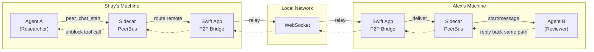

**Network Envelope:**

Messages crossing the P2P network use this envelope format:

```json
{
  "id": "msg-uuid",
  "from": { "peer": "Shay", "session": "s1", "agent": "Researcher" },
  "to": { "peer": "Alex", "session": "s2", "agent": "SecurityAuditor" },
  "type": "chat_start | chat_reply | send_message | delegate_task | blackboard_sync",
  "payload": { "...tool-specific data..." },
  "replyTo": "msg-uuid-of-request",
  "timestamp": "2026-03-21T12:04:32Z",
  "ttl": 30000
}
```

**Cross-Machine Blackboard**

- Blackboard entries scoped to a shared workspace can be synced between peers
- On write: if workspace is shared -> replicate to all peers in that workspace
- Conflict resolution: last-writer-wins with vector clocks

**Cross-Machine Shared Workspace**

- Shared workspaces can span machines using a synced directory (rsync-based or git-based)
- Or agents on different machines work on the same GitHub repo (each clones independently)

**Error Handling:**

- Timeouts: configurable per call (default 30s for blocking, 5s for async). Returns `{ error: "timeout" }`.
- Disconnection: returns `{ error: "peer_disconnected" }`. Agent can retry or fall back to local work.
- Ordering: TCP/WebSocket guarantees per-peer message ordering.

---

## 9. Project Structure

```
ClaudPeer/
  ClaudPeer.xcodeproj
  system-plan-vision.md               -- This document

  ClaudPeer/                           -- SWIFT APP (UI + Persistence + P2P)
    App/
      ClaudPeerApp.swift              -- @main entry, WindowGroup, sidecar lifecycle
      AppState.swift                  -- Global app state (ObservableObject)
    Models/
      Agent.swift                     -- SwiftData @Model (+ instancePolicy, githubRepo)
      Session.swift                   -- SwiftData @Model (+ mode, conversations)
      Conversation.swift              -- SwiftData @Model (unified: user<->agent, agent<->agent, group)
      Participant.swift               -- SwiftData @Model (user or agent session)
      Skill.swift                     -- SwiftData @Model
      MCPServer.swift                 -- SwiftData @Model
      PermissionSet.swift             -- SwiftData @Model
      SharedWorkspace.swift           -- SwiftData @Model
      BlackboardEntry.swift           -- SwiftData @Model
      Peer.swift                      -- SwiftData @Model
    Services/
      SidecarManager.swift            -- Launch/monitor Bun sidecar process
      SidecarProtocol.swift           -- WebSocket message types (Swift <-> Sidecar)
      AgentProvisioner.swift          -- Compose AgentConfig from building blocks
      WorkspaceResolver.swift         -- Resolve working dir (explicit/GitHub/sandbox/shared)
      GitHubIntegration.swift         -- Clone repos, manage branches, parse issue URLs
      P2PNetworkManager.swift         -- Bonjour discovery + WebSocket relay
      SkillPoolManager.swift          -- Import/sync skills from filesystem and peers
      MCPPoolManager.swift            -- Manage MCP server pool
    Views/
      MainWindow/
        MainWindowView.swift          -- NavigationSplitView root
        SidebarView.swift             -- Conversation tree
        ChatView.swift                -- Message list + input
        InspectorView.swift           -- Session metadata panel
      AgentLibrary/
        AgentLibraryView.swift        -- Grid of agent cards
        AgentEditorView.swift         -- Multi-step agent creation wizard
        SkillPickerView.swift         -- Skill selection (step 2)
        MCPPickerView.swift           -- MCP selection (step 3)
        PermissionEditorView.swift    -- Permission config (step 4)
        SystemPromptEditorView.swift  -- Prompt editor (step 5)
      PoolManagers/
        SkillPoolView.swift           -- Browse/manage skills
        MCPPoolView.swift             -- Browse/manage MCPs
      AgentComms/
        AgentCommsView.swift          -- Unified inter-agent communication timeline (filter tabs: All/Chats/Delegations/Blackboard)
      Network/
        PeerNetworkView.swift         -- P2P panel
        PeerBrowserView.swift         -- Browse peer's shared agents
      Components/
        MessageBubble.swift           -- Chat message with participant avatar
        ToolCallView.swift            -- Collapsible tool invocation display
        StreamingIndicator.swift      -- Typing/streaming animation
        AgentCardView.swift           -- Agent card for library grid
        ConversationTreeNode.swift    -- Sidebar tree node (recursive)
        StatusBadge.swift             -- Session/conversation status indicator
    Resources/
      Assets.xcassets
      DefaultAgents/                  -- 7 built-in agent JSON definitions
        orchestrator.json
        coder.json
        reviewer.json
        researcher.json
        tester.json
        devops.json
        writer.json
      DefaultSkills/                  -- 5 ClaudPeer-specific skills
        peer-collaboration/SKILL.md
        blackboard-patterns/SKILL.md
        delegation-patterns/SKILL.md
        workspace-collaboration/SKILL.md
        agent-identity/SKILL.md
      DefaultMCPs.json                -- Pre-registered MCP server configs
      DefaultPermissionPresets.json   -- 5 permission presets
      SystemPromptTemplates/          -- 3 reusable system prompt templates
        specialist.md
        worker.md
        coordinator.md
      BunRuntime/                     -- Bundled Bun binary for sidecar

  sidecar/                             -- TYPESCRIPT SIDECAR (Agent SDK + PeerBus)
    package.json                      -- @anthropic-ai/claude-agent-sdk + ws
    tsconfig.json
    src/
      index.ts                        -- Entry point: create shared ToolContext, start WS + HTTP servers
      ws-server.ts                    -- WebSocket server (Swift <-> sidecar), routes commands including agent.register
      http-server.ts                  -- HTTP REST API (external integration: blackboard, health)
      session-manager.ts              -- SDK query() lifecycle, PeerBus MCP injection, autonomous spawn for delegation
      tools/
        tool-context.ts               -- Shared ToolContext interface (stores, broadcast, spawnSession, agentDefinitions)
        peerbus-server.ts             -- createPeerBusServer() factory using createSdkMcpServer()
        blackboard-tools.ts           -- blackboard_read, blackboard_write, blackboard_query, blackboard_subscribe
        messaging-tools.ts            -- peer_send_message, peer_broadcast, peer_receive_messages, peer_list_agents, peer_delegate_task
        chat-tools.ts                 -- peer_chat_start, peer_chat_reply, peer_chat_listen, peer_chat_close, peer_chat_invite
        workspace-tools.ts            -- workspace_create, workspace_join, workspace_list
      stores/
        blackboard-store.ts           -- In-memory + JSON disk persistence, glob-pattern query
        session-registry.ts           -- Track all active sessions + their agents + registered definitions
        message-store.ts              -- Per-session inboxes for async messages
        chat-channel-store.ts         -- Active chat channels, blocking wait, deadlock detection
        workspace-store.ts            -- Shared workspace directories
      types.ts                        -- Shared types (SidecarCommand, SidecarEvent, AgentConfig, AgentDefinition)
    bun.lockb
```

---

## 10. Technical Decisions

| Decision | Choice | Rationale |
|---|---|---|
| AI interface | Agent SDK (TypeScript) | Persistent sessions, hooks, custom tools, native subagents |
| Sidecar runtime | Bun | Fast startup, single binary (~30MB), TypeScript native |
| Swift <-> Sidecar | WebSocket | Low-latency, bidirectional streaming |
| Persistence | SwiftData | Modern, CloudKit sync potential, Swift-native |
| Layout | NavigationSplitView | Three-panel macOS pattern, conversation tree sidebar |
| P2P discovery | Network.framework (NWBrowser/NWListener) | Native Bonjour, no dependencies |
| Export format | Codable JSON | Human-readable, git-friendly, easy to share |
| Streaming | Async/await + AsyncStream | Native Swift concurrency to SwiftUI |
| PeerBus | Custom SDK tools (not MCP server) | In-process, no IPC overhead, direct session access |
| Real-time UI | SDK hooks | Every tool call visible as it happens |
| External integration | HTTP REST API on sidecar | Simple, universal, any language can participate |

---

## 11. Built-in Ecosystem

ClaudPeer ships with a curated set of default agents, skills, MCP integrations, permission presets, and system prompt templates. These components are designed to work together out of the box, enabling the delegation and collaboration flows described in Section 3 without requiring users to build agents from scratch.

On first launch, the app seeds SwiftData from bundled JSON/Markdown resources in `Resources/`. Users can modify, duplicate, or delete any default -- they are starting points, not locked.

### 11.1 Built-in Agents (7 defaults)

Each agent has a distinct role, permission scope, and instance policy. Together they form a complete team that the Orchestrator can coordinate.

**Orchestrator**

- **Role**: Team lead. Breaks complex requests into subtasks and delegates to specialist agents. Monitors progress via the blackboard. Synthesizes final results. Never does implementation itself.
- **Instance policy**: `.spawn` (one per user task)
- **Model**: opus
- **Permissions**: Full Access
- **Skills**: `peer-collaboration`, `delegation-patterns`, `blackboard-patterns`
- **Key tools**: `peer_delegate_task`, `blackboard_query`, `workspace_create`, `peer_broadcast`
- **System prompt template**: Coordinator
- **Rationale**: Without this agent, users must manually wire multi-agent pipelines. The Orchestrator makes collaboration accessible from a single prompt.

**Coder**

- **Role**: Writes, edits, and refactors code. Works in shared workspaces or cloned repos. Reports progress to the blackboard.
- **Instance policy**: `.pool(max: 3)` (parallel coding tasks)
- **Model**: sonnet
- **Permissions**: Full Access
- **Skills**: `peer-collaboration`, `blackboard-patterns`, `workspace-collaboration`
- **System prompt template**: Specialist (role=software engineer, domain=code implementation)

**Reviewer**

- **Role**: Reviews code, PRs, and architecture decisions. Never writes production code. Writes findings to the blackboard or replies to the requesting agent.
- **Instance policy**: `.singleton` (one reviewer, tasks queue to inbox)
- **Model**: sonnet
- **Permissions**: Read Only + `Bash(git diff *)`, `Bash(gh pr *)`
- **Skills**: `peer-collaboration`, `blackboard-patterns`
- **System prompt template**: Specialist (role=senior code reviewer, domain=code quality and security)

**Researcher**

- **Role**: Gathers information from the web, documentation, and codebases. Writes structured findings to the blackboard with namespaced keys. Never modifies code.
- **Instance policy**: `.spawn`
- **Model**: sonnet
- **Permissions**: Read Only + `WebSearch`, `WebFetch`, `Bash(git log *)`, `Bash(git blame *)`
- **Skills**: `peer-collaboration`, `blackboard-patterns`
- **System prompt template**: Specialist (role=research specialist, domain=information gathering)

**Tester**

- **Role**: Writes and runs tests. Uses Argus MCP for UI/visual testing and AppXray for runtime inspection. Reports test results to the blackboard with pass/fail status.
- **Instance policy**: `.pool(max: 2)` (parallel test runs on different simulators)
- **Model**: sonnet
- **Permissions**: Full Access
- **MCPs**: Argus, AppXray
- **Skills**: `peer-collaboration`, `blackboard-patterns`, `workspace-collaboration`
- **System prompt template**: Specialist (role=QA engineer, domain=testing and quality assurance)

**DevOps**

- **Role**: Handles git workflows, CI/CD, deployment, and environment setup. Does not write application code.
- **Instance policy**: `.singleton`
- **Model**: haiku
- **Permissions**: Git Only
- **Skills**: `peer-collaboration`, `blackboard-patterns`
- **System prompt template**: Specialist (role=DevOps specialist, domain=operations and infrastructure)

**Writer**

- **Role**: Writes documentation, READMEs, specs, PRDs, and UX copy. Reads code to understand behavior, then produces clear documentation.
- **Instance policy**: `.spawn`
- **Model**: sonnet
- **Permissions**: Read + Write Docs
- **Skills**: `peer-collaboration`, `blackboard-patterns`
- **System prompt template**: Specialist (role=technical writer, domain=documentation)

### 11.2 Built-in Skills (5 ClaudPeer-specific)

These skills are specific to the multi-agent context. They teach agents how to use ClaudPeer's collaboration primitives (PeerBus, blackboard, workspaces). Distinct from the user's `~/.cursor/skills/` library, which can also be imported into the skill pool.

**`peer-collaboration`**

Injected into every built-in agent. Covers:
- When to use blocking chat (`peer_chat_start`) vs async messages (`peer_send_message`)
- Group chat etiquette (avoid flooding, use @-mentions)
- Deadlock avoidance (never wait on an agent that's waiting on you)
- How to handle `peer_receive_messages` polling in worker mode
- Communication protocol: acknowledge receipt, summarize outcomes

**`blackboard-patterns`**

Injected into every built-in agent. Covers:
- Key naming conventions: `{phase}.{topic}.{subtopic}` (e.g., `research.sorting.top3`, `impl.mergesort.status`, `review.mergesort.approved`)
- Standard status values: `pending`, `in_progress`, `done`, `failed`, `blocked`
- When to write to blackboard vs send a message (blackboard for persistent/structured data, messages for coordination)
- How to subscribe to changes and react to updates
- JSON value conventions for different data types (findings, decisions, artifacts)

**`delegation-patterns`**

For the Orchestrator and any agent that spawns subtasks. Covers:
- When to use `wait_for_result: true` (sequential dependency) vs `false` (fire-and-forget or parallel)
- Writing effective task descriptions (goal, context, constraints, expected output)
- How to provide context without overwhelming the delegate
- Handling delegation failures (timeout, error, unexpected result)
- Common pipeline templates:
  - **Research -> Implement -> Review**: sequential with blackboard handoffs
  - **Parallel Investigation**: spawn N researchers, merge findings
  - **Iterative Refinement**: implement -> review -> fix -> re-review (max 3 cycles)
  - **Fan-out/Fan-in**: delegate N tasks, wait for all, synthesize

**`workspace-collaboration`**

For agents sharing a directory. Covers:
- File ownership conventions: write a `{filename}.lock` marker while editing
- Directory structure for multi-agent output: `{agent-name}/` subdirectories for work-in-progress, root for final artifacts
- Signaling file readiness: write to blackboard key `workspace.{file}.ready = true`
- Conflict avoidance: check blackboard before writing to shared files
- Cleanup conventions: remove `.lock` files, temporary directories

**`agent-identity`**

Injected at every session start. Covers:
- What ClaudPeer is (multi-agent orchestration system)
- That this agent is one of several, potentially collaborating
- How to discover peers: `peer_list_agents()` returns all active agents
- How to introduce itself in conversations (name, role, current task)
- That all communication is visible to the user in the Comms view

### 11.3 MCP Integrations (pre-registered)

These MCP servers are pre-configured in the MCP pool. Users enable them per-agent in Step 3 of the Agent Editor. All are optional -- agents work without them.

- **Argus** -- UI testing, screenshots, browser automation, mobile simulator control. Primary MCP for the Tester agent. Transport: stdio.
- **AppXray** -- Runtime app inspection: state trees, network traffic, performance metrics, crash logs. Useful for Tester and DevOps. Transport: stdio.
- **GitHub** (via `gh` CLI wrapper) -- Issue management, PR creation/review, code search, repository operations. For Reviewer and DevOps. Transport: stdio.
- **Sentry** -- Error monitoring integration: query recent crashes, stack traces, error frequency. For Tester and DevOps. Transport: http.
- **Linear / Jira** -- Issue tracking: create/update tickets, query sprint boards. For Orchestrator (task tracking) and DevOps. Transport: http.
- **Slack / Discord** -- Notifications: post summaries, alert on failures, share results. For Orchestrator (team updates). Transport: http.
- **Blackboard MCP** (v2, future) -- Exposes the ClaudPeer blackboard as a standard MCP server, allowing Claude Desktop and other external AI tools to read/write the shared knowledge store.

### 11.4 Permission Presets (5 defaults)

Shipped in `DefaultPermissionPresets.json` and loaded into SwiftData on first launch.

- **Full Access** -- All tools allowed. No directory restrictions. For: Coder, Tester, Orchestrator.
  - Allow: `["*"]`
- **Read Only** -- Read, search, and web access. No file writes or shell commands (except read-only git).
  - Allow: `["Read", "Grep", "Glob", "WebSearch", "WebFetch", "Bash(git log *)", "Bash(git diff *)", "Bash(git show *)", "Bash(git blame *)"]`
- **Read + Write Docs** -- Read everything, write only documentation files.
  - Allow: `["Read", "Grep", "Glob", "Write(*.md)", "Write(*.txt)", "Write(*.json)", "WebSearch", "WebFetch"]`
- **Git Only** -- Git and GitHub CLI operations plus read access. For: DevOps.
  - Allow: `["Read", "Grep", "Glob", "Bash(git *)", "Bash(gh *)", "Bash(docker *)", "Bash(npm *)", "Bash(bun *)"]`
- **Sandbox** -- Full access restricted to `~/.claudpeer/sandboxes/`. For untrusted or experimental agents.
  - Allow: `["*"]`
  - Additional directories: `["~/.claudpeer/sandboxes/"]`
  - Deny: directories outside sandbox

### 11.5 System Prompt Templates (3 defaults)

Shipped in `Resources/SystemPromptTemplates/` as Markdown files with `{{placeholder}}` variables that the Agent Editor fills in. Users can also write fully custom prompts.

**Specialist Template** (`specialist.md`)

For focused, single-domain agents. Variables: `{{role}}`, `{{domain}}`, `{{constraints}}`.

Core directive: "You are a {{role}} specialist. You focus exclusively on {{domain}}. When you encounter work outside your domain, delegate to the appropriate specialist using `peer_delegate_task` or ask for help via `peer_chat_start`. {{constraints}}"

Used by: Coder, Reviewer, Researcher, Tester, DevOps, Writer.

**Worker Template** (`worker.md`)

For long-running singleton agents that process an inbox. Variables: `{{role}}`, `{{domain}}`, `{{polling_interval}}`.

Core directive: "You are a long-running {{role}} worker. Between tasks, poll your inbox with `peer_receive_messages()` every {{polling_interval}} seconds. Process tasks sequentially. Write results to the blackboard. When idle, use `peer_chat_listen()` to wait for incoming conversations."

Used by: agents with `.singleton` instance policy operating in `.worker` mode.

**Coordinator Template** (`coordinator.md`)

For orchestration agents that delegate but never implement. Variables: `{{team_description}}`, `{{pipeline_style}}`.

Core directive: "You are a project coordinator managing a team of specialist agents: {{team_description}}. You break complex tasks into subtasks and delegate each to the appropriate specialist. You NEVER write code, tests, or documentation yourself. Track progress on the blackboard. Use {{pipeline_style}} to organize the work. Synthesize results when all subtasks complete."

Used by: Orchestrator.

### 11.6 First-Launch Seeding

On first launch (detected by checking if the SwiftData store is empty), `ClaudPeerApp.swift` runs a seeding routine:

1. Load `DefaultPermissionPresets.json` -> insert 5 `PermissionSet` records
2. Load `DefaultMCPs.json` -> insert MCP server definitions (users still need to configure API keys)
3. Load `DefaultSkills/*/SKILL.md` -> insert 5 `Skill` records with content
4. Load `DefaultAgents/*.json` -> insert 7 `Agent` records, linking to skill/MCP/permission IDs by name
5. Load `SystemPromptTemplates/*.md` -> store as named templates accessible in the Agent Editor

All seeded records have `origin: .builtin`. Users can modify them freely -- edits are persisted. A "Reset to Defaults" option in Settings can re-seed.

---

## 12. Implementation Roadmap

### Phase 1: Foundation ✅

1. **Swift project scaffold** -- Xcode project, SwiftUI + SwiftData, basic window
2. **SwiftData models** -- Agent, Session, Conversation, Participant, Skill, MCPServer, PermissionSet
3. **Sidecar scaffold** -- TypeScript project, Bun, WebSocket server, message types
4. **SidecarManager** -- Swift launches Bun, WebSocket client, reconnect on crash
5. **Session lifecycle** -- Create/resume/fork/pause via SDK, streaming to Swift

### Phase 2: Chat and UI ✅

6. **Main window** -- NavigationSplitView, sidebar tree, chat area, inspector
7. **Chat view** -- Streaming messages, tool call blocks, input with slash commands
8. **Hook engine** -- PreToolUse/PostToolUse -> real-time UI events

### Phase 3: Agent Provisioning ✅

9. **Agent editor** -- 5-step wizard (identity, skills, MCPs, permissions, prompt)
10. **Skill pool** -- Import from `~/.cursor/skills`, browse, categorize
11. **MCP pool** -- Register servers, test connections, cache schemas
12. **Agent provisioner** -- Compose AgentConfig, send to sidecar

### Phase 4: Inter-Agent Communication ✅

13. **PeerBus tool framework** -- ToolContext, PeerBus MCP server factory, shared context injection into all SDK sessions
14. **PeerBus messaging** -- peer_send_message, peer_broadcast, peer_receive_messages, peer_list_agents, peer_delegate_task
15. **PeerBus chat** -- Blocking conversations (peer_chat_start, peer_chat_reply, peer_chat_listen, peer_chat_close, peer_chat_invite), deadlock detection in ChatChannelStore
16. **Blackboard SDK tools** -- blackboard_read, blackboard_write, blackboard_query, blackboard_subscribe as in-process SDK tools, emitting blackboard.update events
17. **Shared workspaces** -- workspace_create, workspace_join, workspace_list with WorkspaceStore
18. **Swift event handling** -- AppState handles peerChat, peerDelegate, blackboardUpdate events; persists to SwiftData (child conversations, BlackboardEntry upserts); agent.register command sends agent definitions to sidecar on connect
19. **Agent Comms view** -- Unified timeline UI with filter tabs (All/Chats/Delegations/Blackboard)
20. **Sidebar tree** -- Parent-child conversation nesting with DisclosureGroup, type-specific icons (delegation, agent-to-agent, user+agent, group)

### Phase 4.5: Built-in Ecosystem ✅

18. **ClaudPeer-specific skills** -- 5 SKILL.md files (peer-collaboration, blackboard-patterns, delegation-patterns, workspace-collaboration, agent-identity) in `Resources/DefaultSkills/`
19. **Built-in agent definitions** -- 7 agent JSON files (Orchestrator, Coder, Reviewer, Researcher, Tester, DevOps, Writer) in `Resources/DefaultAgents/`
20. **Permission presets and MCP configs** -- `DefaultPermissionPresets.json` (5 presets) and `DefaultMCPs.json` (4 servers) in `Resources/`
21. **System prompt templates** -- 3 template files (specialist.md, worker.md, coordinator.md) in `Resources/SystemPromptTemplates/` with `{{variable}}` placeholder resolution
22. **First-launch seeding** -- `DefaultsSeeder` seeds all 5 categories (permissions, MCPs, skills, agents, templates) into SwiftData on first launch, with cross-entity linking (agents reference seeded skills, MCPs, and permissions by name)
23. **Catalog PeerBus alignment** -- All 30 catalog agents include PeerBus system skills (peer-collaboration, blackboard-patterns, agent-identity) in their `requiredSkills` -- every agent in ClaudPeer can collaborate via PeerBus out of the box

### Phase 5: Persistence and Polish

23. **Session persistence** -- Save to SwiftData, resume via SDK, crash recovery
24. **GitHub integration** -- Clone repos, branch from issues, gh CLI permissions
25. **Conversation forking** -- Fork from any point in history

### Phase 6: P2P Networking (v1)

26. **Bonjour discovery** -- Advertise/browse `_claudpeer._tcp`
27. **Definition sharing** -- Browse/import agents and skills from peers
28. **P2P Network panel** -- UI for peer management

### Future: P2P v2

29. **Peer registry in sidecar** -- Remote agent awareness
30. **PeerBus routing layer** -- Local vs remote detection
31. **Swift P2P bridge** -- Cross-machine message relay
32. **Blackboard as MCP server** -- Universal AI tool integration
